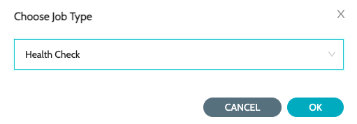
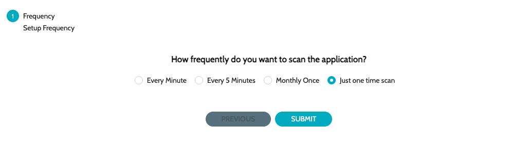

# Configure Schedule


* Repeatedly creating the same schedule will just overwrite the pre-existing schedule.


1. Navigate to **`Schedules`** -> **`Schedules`** and click on **`Configure Schedule`**
2.  Select **`Health Check`** job type\
    &#x20;

    <figure><figcaption></figcaption></figure>
3.  Select the schedule/frequency at which the analysis should be performed 

    <figure><figcaption></figcaption></figure>
4. Click on **`Submit`** to configure the schedule

### See Also

* [Endpoints](endpoints/)
* [Categories](../categories/)
* [Public Status Page](status-pages/public-status-page.md)
* [Private Status Page](status-pages/private-status-page.md)
