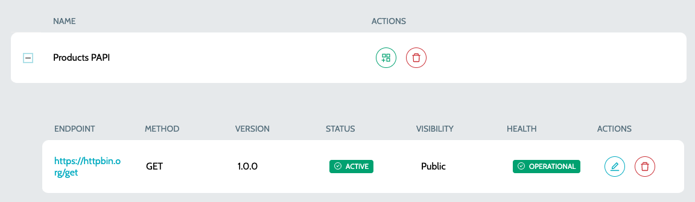

# Endpoints

Endpoints for which the health check will be performed based on the configured interval.

### Endpoints

1. Navigate to **`IZ Pulse`** -> **`Endpoints`**&#x20;
2. Each endpoint can have multiple versions
3. Click on the **`Add Version`** action to create a new endpoint version. Refer Configure Endpoint

### Versions

1.  Navigate to **`IZ Pulse`** -> **`Endpoints`** and click on the **`Plus`** icon to view all the versions  

    <figure><figcaption></figcaption></figure>
2. Details include:
   1. **`Endpoint`** - Endpoint for which the health check should be performed
   2. **`Method`** - HTTP method of the endpoint Eg: GET, POST etc
   3. **`Version`** - Version of the endpoint
   4. **`Status`** - Active or Disabled
   5. **`Visibility`** - Private or Public. Private endpoints will not be visible in Public Status Pages
   6. **`Health`** - Health of the endpoint. Health will be available once the **`Health Check`** job schedule is configured
3. Click on **`Edit Endpoint`** action to edit the endpoint details

### See Also

* [Configure Schedule](../configure-schedule.md)
* [Categories](../../categories/)
* [Status Pages](../status-pages/)
