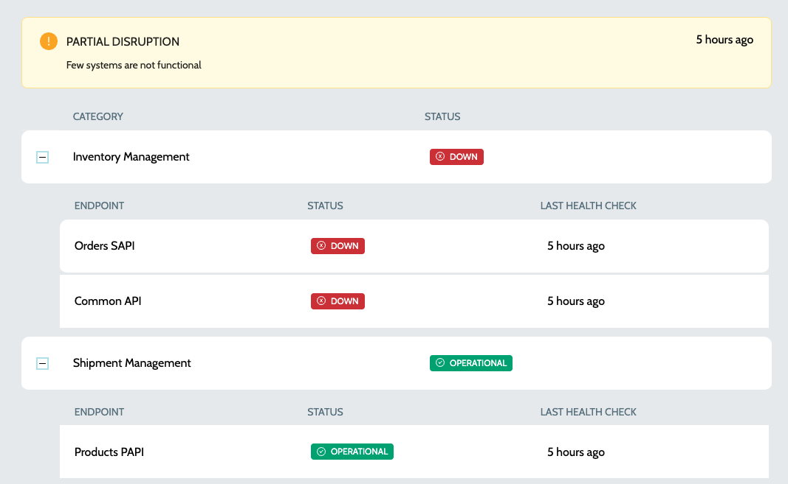

# Public Status Page

Public Status Pages displays only the public endpoints and the status page URL is unauthenticated. To view the public status page -

1.  Navigate to **`IZ Pulse`** -> **`Status Pages`**  

    <figure><figcaption></figcaption></figure>
2.  Click on `View Public Page` action to view the public page\
    &#x20;

    <figure><figcaption></figcaption></figure>
3. Details includ:
   1. **`Category Name`** - Name of the category
   2. **`Category Status`** - Status of the category, which can be one of
      1. **`OPERATIONAL`** - All endpoints are operational
      2. **`DOWN`** - All endpoints are down
      3. **`PARTIAL DISRUPTION`** - Few of the endpoints might be down and few might be operational
   3. **`Endpoint Name`** - Name of the endpoint system
   4. **`Endpoint Status`** - Status of the endpoint system, which can be one of
      1. **`OPERATIONAL`** - All endpoints are operational
      2. **`DOWN`** - All endpoints are down
   5. **`Last Health Check Date`** - Time since the last health check was performed

### See Also

* [Configure Schedule](../configure-schedule.md)
* [Endpoints](../endpoints/)
* [Categories](../../categories/)
* [Status Pages](./)
