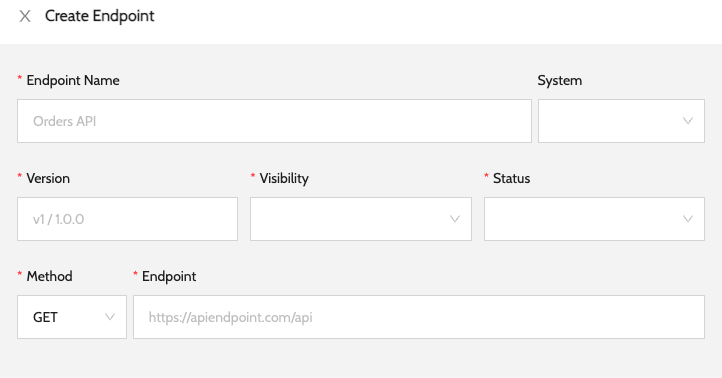
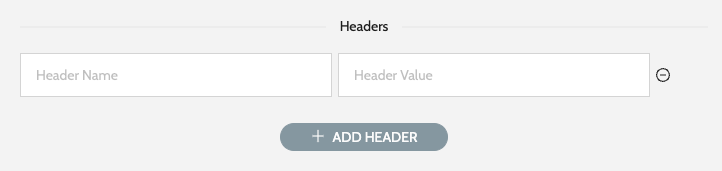
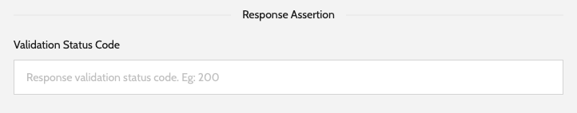
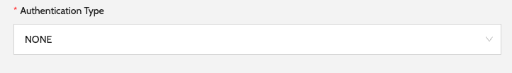
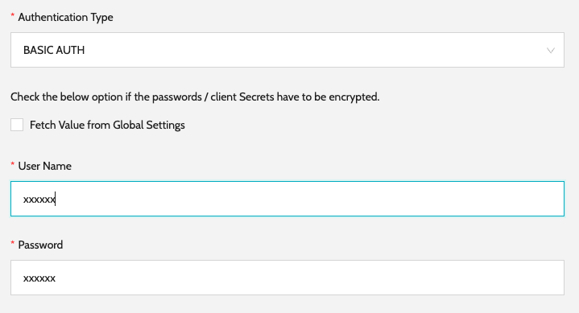
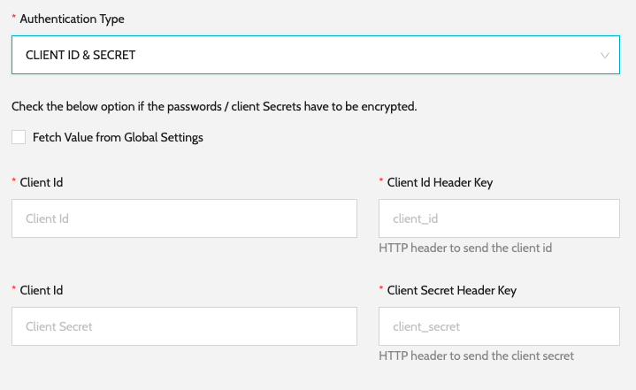
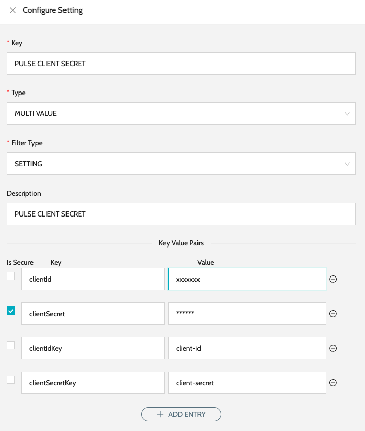
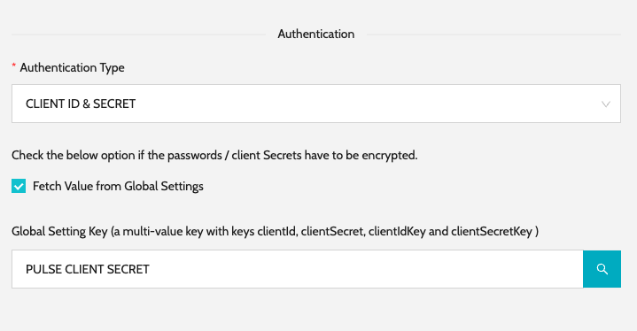

# Configure Endpoint

### Configure Endpoint & Version

1. Navigate to **`IZ Pulse`** -> **`Endpoints`** and click on **`Create Endpoint`**
2. Enter the basic details which include -
   1. **`Endpoint Name`** - Name of the endpoint
   2. **`System`** - Optional. If a system is selected, only **`Agents`** associated with the system can perform the health check
   3. **`Version`** - Version of the endpoint
   4. **`Visibility`** - Private or Public. Private endpoints will not be visible in Public Status Pages
   5. **`Status`** - Active or Disabled. Disabled endpoints will not be displayed in the status page
   6. **`Method`** - HTTP method. E.g.: GET, POST, etc.
   7.  **`Endpoint`** - Valid HTTP endpoint  

       <figure><figcaption></figcaption></figure>
3.  Add optional headers. These headers will be sent for every health check request.\
    &#x20;

    <figure><figcaption></figcaption></figure>
4.  Add response assertion. Assertion status code will be validated against the actual response status code. 

    <figure><figcaption></figcaption></figure>
5.  Authentication Type. E.g.: None, Basic, Client Secret. More information can be found in the below section.\
    &#x20;

    <figure><figcaption></figcaption></figure>

### Configure Authentication

1. Basic Authentication
   1.  Configure the Username and Password required to connect to the API to perform the health check.  

       <figure><figcaption></figcaption></figure>
2. Client ID and Secret
   1.  Configure the Username and Password required to connect to the API to perform the health check.  

       <figure><figcaption></figcaption></figure>

### Configure Authentication In Global Settings

1. This setting will be useful if the same set of credentials have to be used for authenticating multiple endpoints.
2. Below is an example of configuring Client Id and Secret in Global Setting and reusing it while configuring the endpoint.
3. Navigate to **`Global Settings`** -> **`Settings`** and Click on **`Configure Settings`**
4.  Configure the **`Key`**, select type as **`MULTI VALUE`**, Filter Type as **`SETTING`**. Add required Key Value pairs using the `Add Entry` option.  

    <figure><figcaption></figcaption></figure>
5.  We can now use the new Setting identified by its key while configuring the endpoint.\
    &#x20;

    <figure><figcaption></figcaption></figure>

### See Also

* [Configure Schedule](../configure-schedule.md)
* [Endpoints](./)
* [Categories](../../../../iz-suite/iz-pulse/categories/)
* [Status Pages](../status-pages/)
