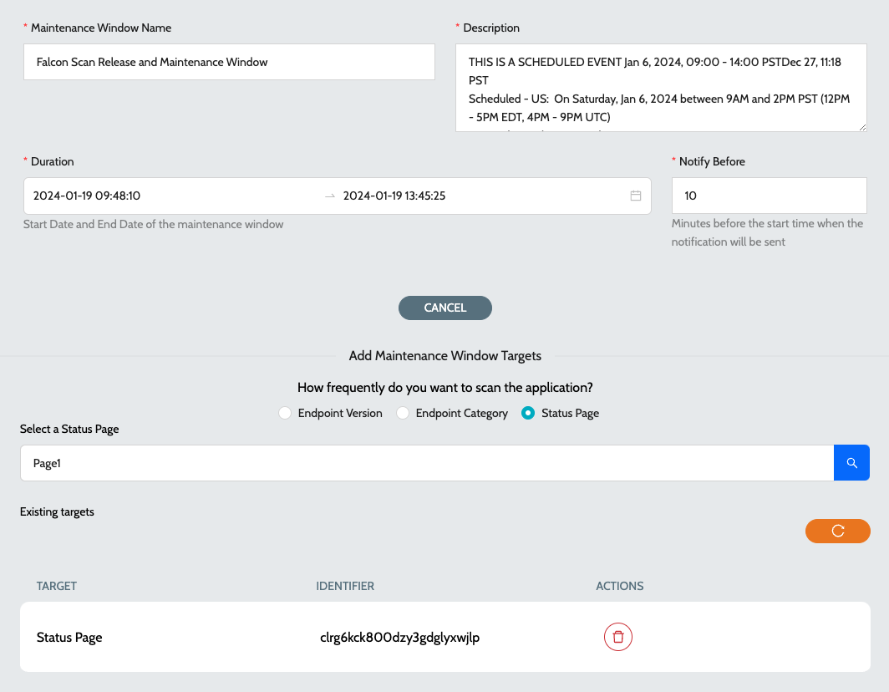

# Configure Maintenance Window

A maintenance window refers to a designated period of time during which planned maintenance activities or system updates are performed. Maintenance windows can be performed on a **`Status Page`**, **`Category`** or **`Endpopint`**. Maintenance windows are commonly scheduled during periods of low user activity to minimize the impact on users and business operations.

Communication with stakeholders is crucial during the planning and execution of maintenance windows to inform users about potential downtime or disruptions. All users subscribed to the **`Status Pages`** will receive the maintenance window updates.

### Configure

1. Navigate to **`IZ Pulse`** -> **`Maintenance Window`**
2. Click on the **`Configure Window`** action to create a new maintenance window.
3. Maintenance window configuration parameters -
   1. Start time - Start date and time of the maintenance window
   2. End time - End date and time of the maintenance window
   3. Name - Name of the maintenance window
   4. Description - Description of the maintenance window
   5. Notify Before - Duration in minutes before which the notification should be sent to subscribed users
4. Click on **`Submit`** to configure the maintenance window
5. Select the appropriate target and add any of the -
   1. Status Pages - Endpoints in the status page which will be under maintenance
   2. Categories - Endpoints in the categories which will be under maintenance
   3.  Endpoints - Endpoints which will be under maintenance\
       &#x20;

       <figure><figcaption></figcaption></figure>

### See Also

* [Configure Schedule](../configure-schedule.md)
* [Endpoints](../endpoints/)
* [Categories](../../../../iz-suite/iz-pulse/categories/)
* [Public Status Page](../status-pages/public-status-page.md)
* [Private Status Page](../status-pages/private-status-page.md)
