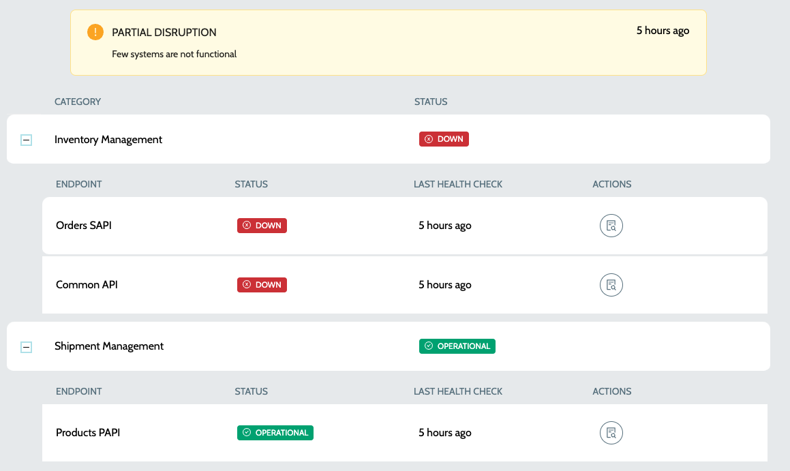

# Private Status Page

Private Status Pages displays both public & private endpoints and status page URLs are authenticated. To view the private status page -

1.  Navigate to **`IZ Pulse`** -> **`Status Pages`**\
    &#x20;

    <figure><figcaption></figcaption></figure>
2.  Click on `View Private Page` action to view the private page  

    <figure><figcaption></figcaption></figure>
3. Details include -
   1. **`Category Name`** - Name of the category
   2. **`Category Status`** - Status of the category, which can be one of
      1. **`OPERATIONAL`** - All endpoints are operational
      2. **`DOWN`** - All endpoints are down
      3. **`PARTIAL DISRUPTION`** - Few of the endpoints might be down and few might be operational
   3. **`Endpoint Name`** - Name of the endpoint system
   4. **`Endpoint Status`** - Status of the endpoint system, which can be one of
      1. **`OPERATIONAL`** - All endpoints are operational
      2. **`DOWN`** - All endpoints are down
   5. **`Last Health Check Date`** - Time since the last health check was performed
4. Actions include options to -
   1. View the logs of health check execution command
   2. View the operational **`Run Books`** if any in case of failure

### See Also

* [Configure Schedule](../configure-schedule.md)
* [Endpoints](../endpoints/)
* [Categories](../../../../iz-suite/iz-pulse/categories/)
* [Status Pages](./)
