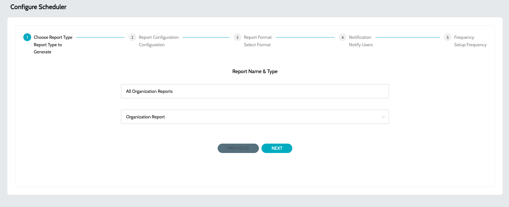
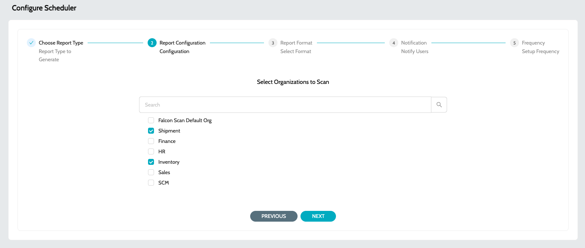
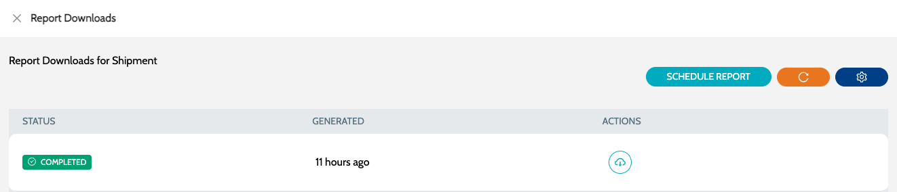

# Configure  Organization Report

## Organization Report

### Schedule Organization Report

Organization reports can be scheduled to be generated and optionally emailed to users on a regular basis

* Navigate to **`Schedules`** -> **`Schedules`**
*   Click on **`Configure Schedule`** and select **`Reporting`** job type\
    &#x20;

    <figure><figcaption></figcaption></figure>
*   Select **`Organization Report`** type and specify a name for the report\
    &#x20;

    <figure><figcaption></figcaption></figure>
*   Select the required Organizations for which the report has to be generated  

    <figure><figcaption></figcaption></figure>
*   Select the report format. Possible options - **`Full Report`** or **`Executive Summary`**  

    <figure><figcaption></figcaption></figure>
*   Optional - Email IDs to which the report has to be sent across\
    &#x20;

    <figure><figcaption></figcaption></figure>
*   Select the schedule at which the report should be generated and shared across  

    <figure><figcaption></figcaption></figure>

### Download Scheduled Reports

Generated reports can be download -

1. From Job Schedules
   1. Click on the **`View Job Executions`** action item to view the reports generated.
   2.  Click on **`Download Report`** action item to download the generated report.  

       <figure><figcaption></figcaption></figure>
2. From Report Exports
   * Navigate to **`Reporting`** -> **`Report Exports`**
   *   Search for the required report and click on **`Download Report`** action item to download the generated report.  

       <figure><figcaption></figcaption></figure>

### Generate Individual Organization Report

* Navigate to **`Organizations`** -> **`My Organizations`**
* Click on `Report Downloads` action item.
* Click on `Schedule Report` action item to schedule the report generation for the organization.
*   `Download Report` action item will be enable once the report is generated  

    <figure><figcaption></figcaption></figure>

### See Also

* [Deprecations](../iz-lens/deprecations/)
* [Aggregated Dashboard](../iz-eye/dashboard.md)
* [Application Dashboard](../iz-eye/applications/application-dashboard.md)
* [Mule Projects](../iz-eye/applications/mule-applications.md)
* [API Applications](../iz-eye/applications/api-applications.md)
