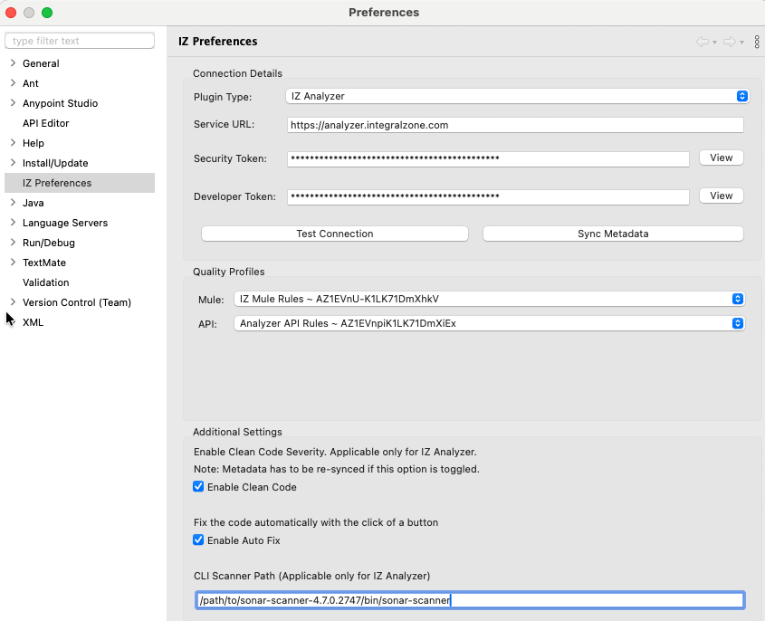

# IZ Analyzer Plugin


Before installing the plugin, make sure you have:

* Purchased a valid license for IZ Scan Anypoint Studio Plugin.
* For on-premises or hybrid instances, please use your organization specific service URL instead of https://analyzer.integralzone.com
* To scan and upload projects from the IDE, configure the Scanner CLI path. You can download the SonarScanner CLI from [here](https://docs.sonarsource.com/sonarqube-server/analyzing-source-code/scanners/sonarscanner). This feature is available from Anypoint Studio plugin version >=5.1.8.


### Connection Setup

1. Go to **`Window`** -> **`Preferences`** -> **`IZ Preferences`** (**`Anypoint Studio`** -> **`Settings`** -> **`IZ Preferences`** in Mac)
   1. Choose **`IZ Analyzer`** plugin type
   2. Provide the `Service Url`. Service URL for cloud users will be https://analyzer.integralzone.com/ and for on-premises or hybrid installations, use your organization specific URL.
   3.  Login to the IZ Analyzer web application. Click on your Profile icon and navigate to **`My Account`**. Select the **`Security`** tab and generate a new token by providing a token name. Use this generated token in the **`Access Token`** field.  

       <figure><figcaption></figcaption></figure>
2. Use the **`Developer Token`** shared as part of the license details
3. Click on **`Test Connection`** to ensure connection is successful.
4. Click on **`Sync Metadata`** to sync the available `Quality Profiles` and corresponding rules -
   1. `Quality Profiles` -> Choose the required Quality Profile to sync the rules from server
   2.  Choose the **`Enable Clean Code Severity`** to display the Severities based on Clean Code Severity attributes (i.e. HIGH, MEDIUM, LOW). Ensure to click on **`Sync Metadata`** button when this option is toggled. The subsequent scans will start displaying the updated Severities in **`On The Fly Results`**.  

       <figure><figcaption></figcaption></figure>
   3. **`CLI Scanner Path`** -> Specify the path to the downloaded SonarScanner CLI. Provide the full path to the executable, which will be used to run the analysis and upload the project to the configured server.
   4. Choose **`Apply`** and Select **`Apply and Close`**

### See Also

* [Configure IZ Scan Plugin](iz-scan-plugin.md)
* [Source Code Analysis - On The Fly Results](../source-code-analysis/on-the-fly-results.md)
