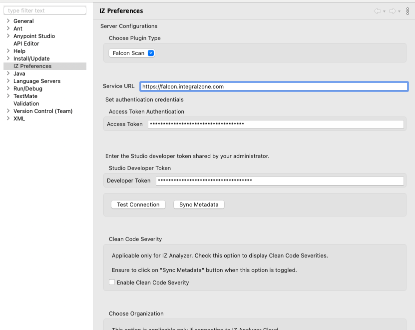

# IZ Suite Configuration

## IZ Scan Plugin - IZ Scan Configuration


Before installing the plugin, make sure you have:

* Purchased a valid license for the [IZ Scan Plugin](../installation/install-iz-analyzer-studio.md).
* For on-premises or hybrid instances, please use your organization-specific service URL instead of https://iz.integralzone.com.


### Connection Setup

1. Go to **`Window`** -> **`Preferences`** -> **`IZ Preferences`** (**`Anypoint Studio`** -> **`Settings`** -> **`IZ Preferences`** in Mac)
   1. Choose **`IZ`** plugin type
   2. Provide the `Service Url`. Service URL for cloud users will be https://iz.integralzone.com/ and for on-premises or hybrid installations, use your organization-specific URL.
   3. A security token can be generated by following the steps in [Generating Security Token](../../ci-cd-integration/generate-security-token.md). Use this generated token in the **`Access Token`** field.
2. Use the **`Developer Token`** shared as part of the license details
3. Click on **`Test Connection`** to ensure the connection is successful.
4. Click on **`Sync Metadata`** to sync the available `Quality Profiles` and corresponding rules -
   1.  `Quality Profiles` -> Choose the required Quality Profile to sync the rules from the server.\
       &#x20;

       <figure><figcaption></figcaption></figure>
   2. Choose **`Apply`** and Select **`Apply and Close`**

### See Also

* [Configure IZ Analyzer Plugin](iz-analyzer-configuration.md)
* [Source Code Analysis - On The Fly Results](../source-code-analysis/anypoint-studio-analysis.md)
