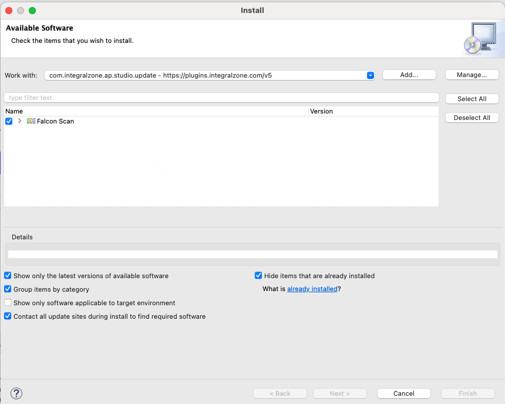

# Install IZ Analyzer Studio

## Download and Install IZ Scan Studio Plugin


Before installing and using IZ Scan Anypoint Studio Plugin, make sure you have:

* Purchased a valid license.
* For on-premises or hybrid instances, please use your organization specific service URL.


### Install Plugin

1.  Go to **`Help`** -> **`Install New Software`** and add the plugin update site https://plugins.integralzone.com/v5 in the address bar.\
    &#x20;

    <figure><figcaption></figcaption></figure>
2. Select the **`IZ Scan Analysis`** feature, click on **`Next`** and follow the installation instructions.
3. Restart Anypoint Studio after installation

### See Also

* [Update Studio Plugin](update-iz-analyzer-studio.md)
* [Remove Studio Plugin](remove-iz-analyzer-studio-plugin.md)
* [Configure Studio Plugin](iz-suite-configuration.md)
