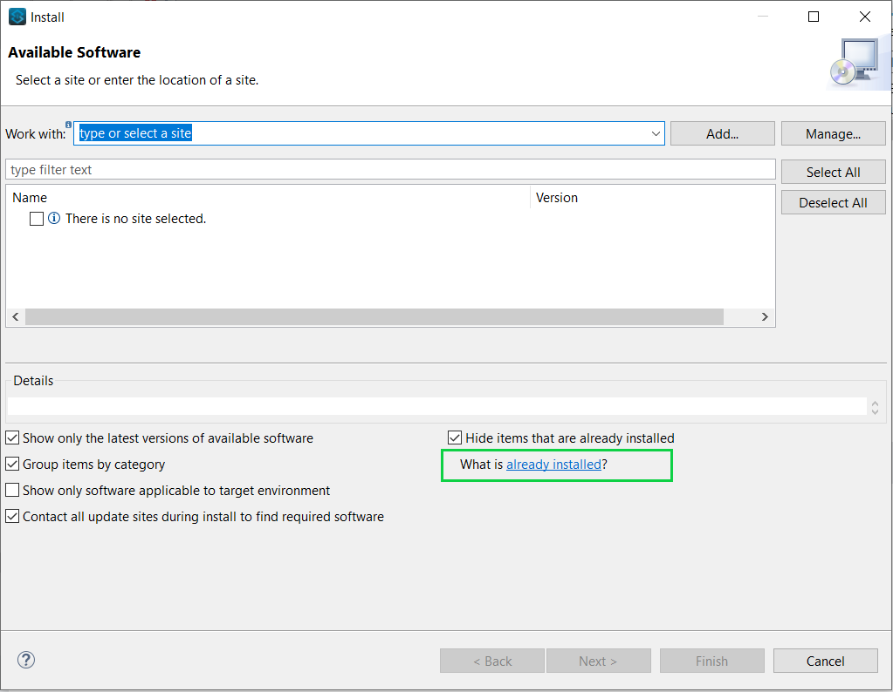
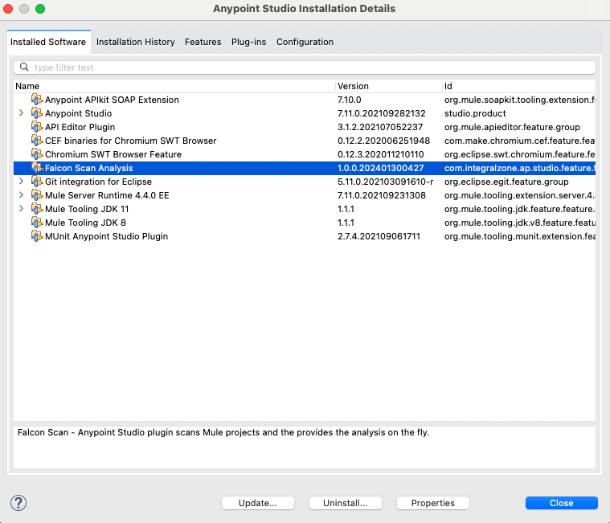
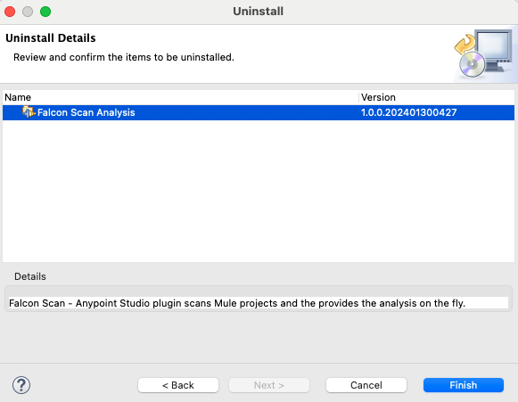

# Remove Plugin

### Remove Plugin

1. Go to **`Help`** -> **`Install New Software`**
   1.  Click On **`already installed`**.  

       <figure><figcaption></figcaption></figure>
   2.  Select **`IZ Scan Analysis`**  

       <figure><figcaption></figcaption></figure>
   3.  Click on **`Unistall`** and follow the uninstallation instructions  

       <figure><figcaption></figcaption></figure>
2. Restart Studio after uninstallation

### See Also

* [Install Studio Plugin](install-plugin.md)
* [Update Studio Plugin](update-plugin.md)
* [Configure Studio Plugin](../configuration/iz-analyzer-plugin.md)
