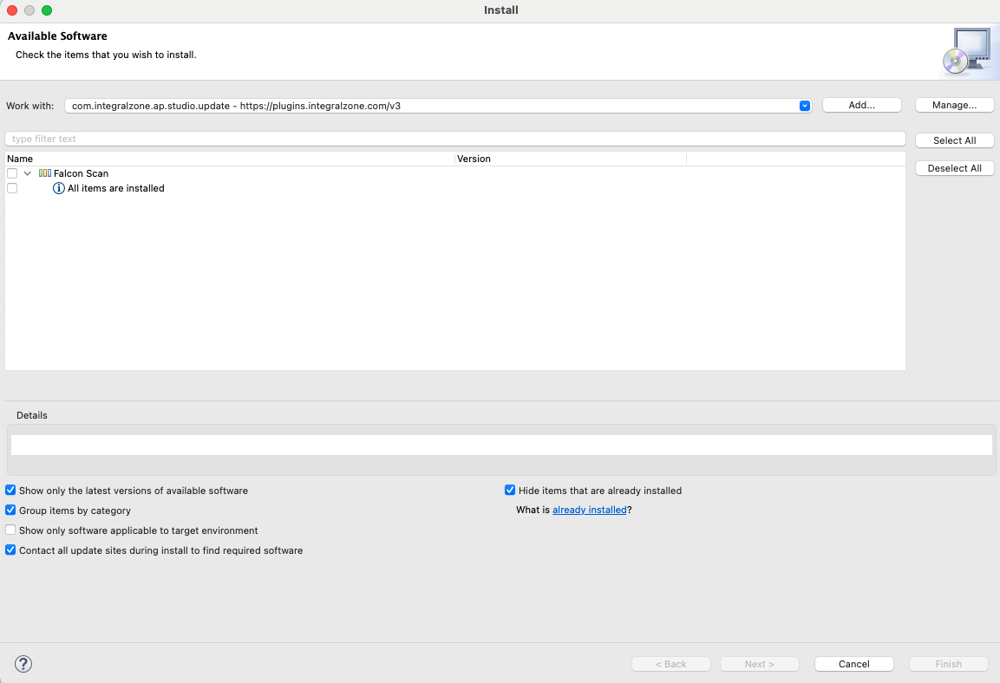

# Update Plugin

## Update IZ Scan Studio Plugin

### Update Plugin

1.  Go to **`Help`** -> **`Install New Software`** and add the plugin download link http://plugins.integralzone.com/v5 in the address bar.  

    <figure><figcaption></figcaption></figure>
2. Select the required features, click on **`Next`** and follow the installation instructions
3. Restart Studio after installation


* If a new version of the plugin is not available, then **`All items are installed`** message will be displayed


<figure><figcaption></figcaption></figure>

### See Also

* [Install Studio Plugin](install-plugin.md)
* [Remove Studio Plugin](remove-plugin.md)
* [Configure Studio Plugin](../configuration/iz-analyzer-plugin.md)
