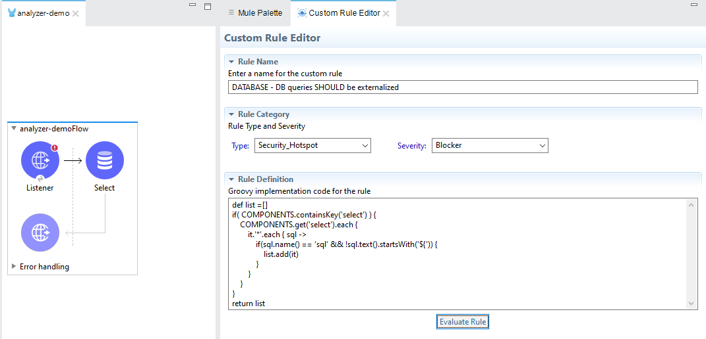
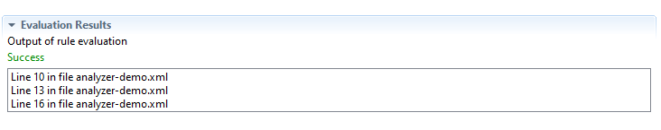
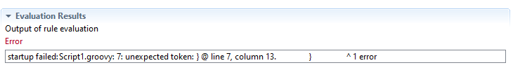
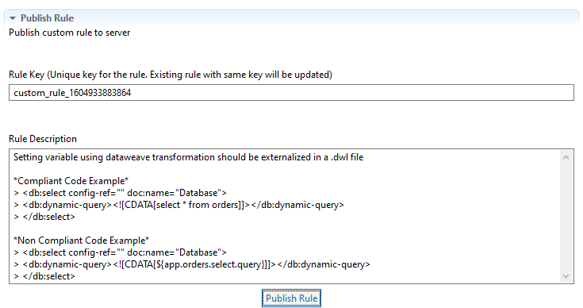

# Rules Playground

## Anypoint Studio - Rules Playground

Rules Playground is a tool for quick and easy development of **`Custom Rules`**


* Rules Playground functionality is part of Anypoint Studio plugin. Refer to [Installing Anypoint Studio plugin](install-iz-analyzer-studio.md) for more information.


### Features

1. Develop/Create a custom rule definition and evaluate against the project
2. Provides feedback about any syntax errors in the rule definition
3. Capability to evaluate the rule definition on Mule components, APIs, property files, pom.xml etc.
4. Publish the rule definition to configured server and activate it

### Custom Rule Editor

5. Click on **`Window`** -> **`Show View`** -> **`Other`** -> **`IZ Scan`** -> **`Custom Rule Editor`**
6. Custom rule editor properties -
   1. **`Rule Name`** - Name of the new custom rule
   2. **`Type`** - Select the type of rule, which can be one of
      1. Code Smell
      2. Bug
      3. Vulnerability
      4. Security Hotspot
   3. **`Severity`** - Select the rule severity, which can be one of
      1. Blocker
      2. Critical
      3. Major
      4. Minor
      5. Info
   4.  **`Rule Definition`** - Groovy definition for the custom rule\
       &#x20;

       <figure><figcaption></figcaption></figure>

### Evaluating Custom Rule

1. Click on **`Evaluate Rule`** button to validate and execute the rule definition
2. Custom rule will be applied on the current project and results will be displayed in **`Evaluation Results`** section
3.  Results in case of valid rule definition\
    &#x20;

    <figure><figcaption></figcaption></figure>
4.  Results in case of syntax errors in the rule definition\
    &#x20;

    <figure><figcaption></figcaption></figure>

### Publishing Custom Rule


Before publishing a custom rule, make sure you have:

* Created a custom Quality Profile from the default Profile.
* Appropriate access in the server to publish the rule.


1. Expand the **`Publish Rule`** section
2. Enter the Rule Key and Description -
   1. **`Key`** - Unique key for the custom rule. The key will be auto populated, which can be changed if there are any conflicts
   2.  **`Description`** - Description of the rule. Markdown syntax can be used to describe the rule\
       &#x20;

       <figure><figcaption></figcaption></figure>
3. Click on **`Publish Rule`** to upload the rule to configured server. Rule will be activated in the selected Quality Profile.

### See Also

* [On The Fly Results](anypoint-studio-analysis.md)
* [Source Code Analysis - Auto Fix Issues](autofix.md)
