# Anypoint Studio Analysis

## Code Analysis in Studio


Before analyzing the source code in Studio, make sure you have either:

* Installed [IZ Scan - Anypoint Studio Plugin](../installation/install-iz-analyzer-studio.md)
* Configured the plugin either for:
  * [IZ Analyzer](../configuration/iz-analyzer-configuration.md)
  * [IZ Scan](../configuration/iz-suite-configuration.md)


### On The Fly Results

**`On The Fly Results`** table/view will display the issues related to the project that the user is working on. Project is determined based on the current active file (i.e., the file that the user is working on) in Anypoint Studio.\
Issues will be detected and reported as and when the connectors are configured in the editor. With this, the issues can be fixed even before they exist.\
Follow the steps below to explore **`On The Fly Results`** view.

1.  Go to **`Window`** -> **`Show View`** -> **`other`** -> **`IZ Scan`** -> select **`On the Fly Results`**  

    <figure>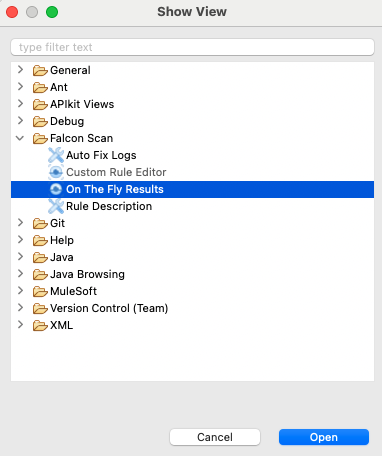<figcaption></figcaption></figure>
2.  Open any mule project xml, the issues will be automatically detected and the results can be seen in **`On the Fly Results`** panel.  

    * NOTE: **`On The Fly Results`** scans the whole project corresponding to current mule project xml and displays the results

    <figure>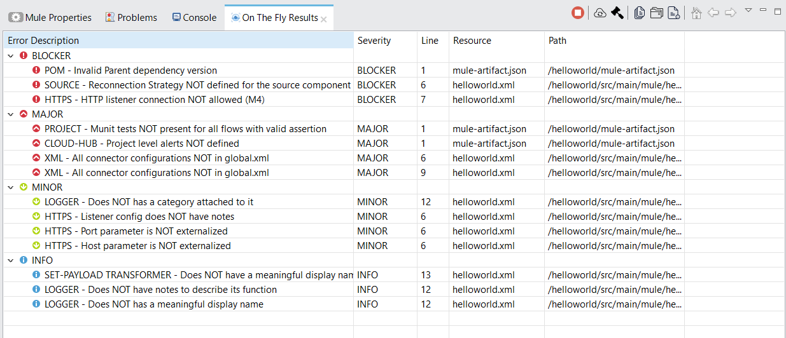<figcaption></figcaption></figure>

### On The Fly Results Tab Features

The Results tab provides options such as start or stop analysis, sync rules from the server, reload on the fly results, and helps us to quickly sort through the results based on file type, component type, and severity.

1.  Navigate to **`Window`** -> **`Show View`** -> **`other`** -> **`IZ Scan`** -> select **`On the Fly Results`**. The options are displayed at the top right corner.  

    <figure>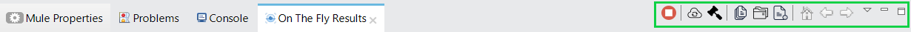<figcaption></figcaption></figure>
2.  By default, the analysis is active and will immediately report any issues it sees fit. Clicking on the **`Stop Button`** will stop the analysis. You can start it at a later time once a part of your development is completed.\
    &#x20;

    <figure>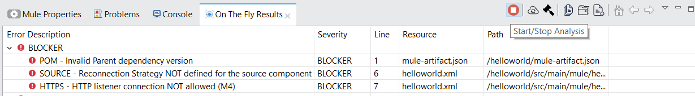<figcaption></figcaption></figure>
3.  Your organization might have added new rules or updated the rules in server. By clicking on the **`Sync Rules`** option, you will be importing these updated rules onto Anypoint studio.\
    &#x20;

    <figure><figcaption></figcaption></figure>
4.  By Clicking on **`Reload on the fly results`** option, your project will be validated against the rules to refresh the tab so as to display any new issues along with the previously displayed issues.  

    <figure>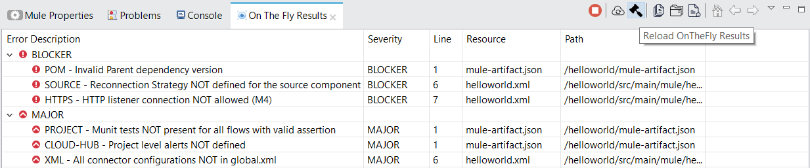<figcaption></figcaption></figure>
5.  The Issues seen in the On The Fly Results tab can be grouped based on file type, component type and severity.

    1.  Grouping based on **`File Type`**.  

        <figure>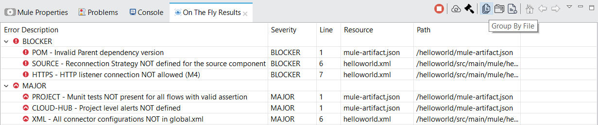<figcaption></figcaption></figure>
    2.  Grouping based on **`Component Type`**.  

        <figure>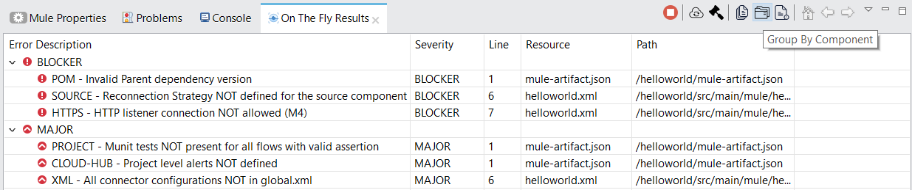<figcaption></figcaption></figure>
    3.  Grouping based on **`Severity`**.  

        <figure>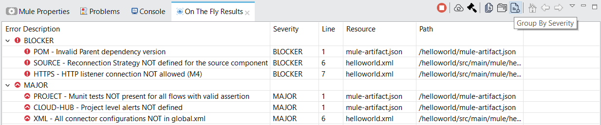<figcaption></figcaption></figure>

    \== Issue Fix Recommendation

**`On The Fly Results`** precisely point out the problem in each file with line number, but many users might not be aware of the issue fix.\
Issue fix recommendation helps to deal with this scenario with a detailed description and examples on how to fix the issue.

1.  Double-click on any issue that needs a fix to open up the **`Rule Description`** view.\
    &#x20;

    <figure>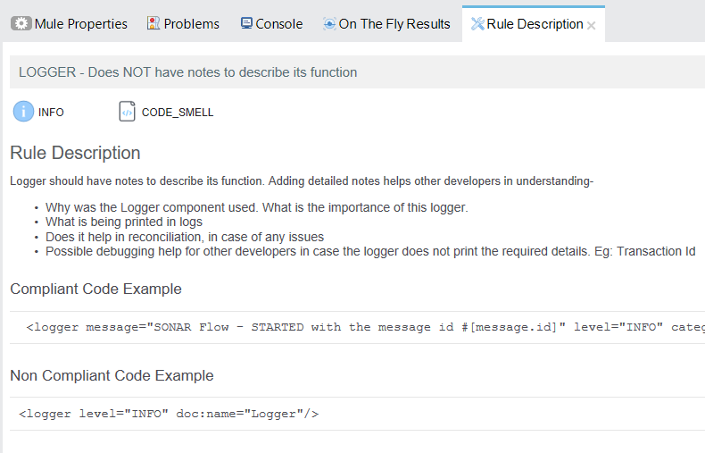<figcaption></figcaption></figure>
2. **`Rule Description`** view provides information about:
   1. Type of Issue. E.g.: **`Code Smell`**, **`Bug`**
   2. Detailed description of the violated rule/issue
   3. Noncompliant Code Example
   4. Compliant Code Example, which guides developers on how to fix the issue
   5. Optionally, an external link to any official documentation for further information about the fix

### Upload to Server

After development is complete, users might want to upload the project to the server and save the analysis results or for any other purposes.

IZ Analyzer provides an easy option to upload a project to the server from Anypoint Studio.


This step assumes that the server details are configured well in advance as mentioned in Installing Studio Plugin SonarQube version 9.x and above requires Java version 11 to scan the projects. It is recommended to use Anypoint Studio version greater than 7.9.0 to use this feature with the latest versions of SonarQube.


1.  Right-click on the project that needs to be uploaded to the server, then click on **`IZ Scan - Server Upload`**  

    <figure>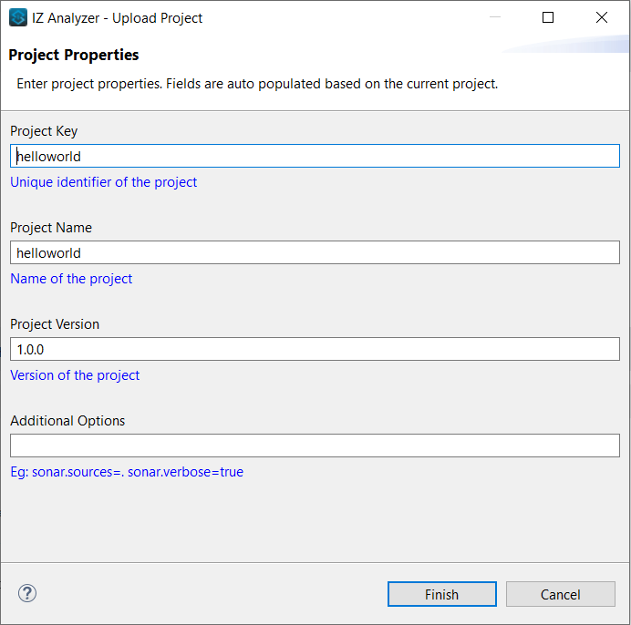<figcaption></figcaption></figure>
2. Fill in the values required for server upload and click on **`Finish`**:
   1. Project Key - Unique key of the project
   2. Project Name - Display name of the project
   3. Project version - Version of the project
3.  Detailed logs of upload/scanner process will be displayed in **`console`** view  

    <figure>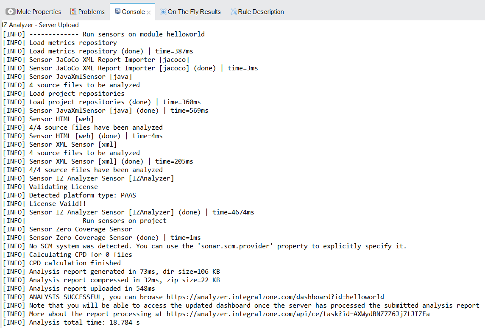<figcaption></figcaption></figure>
4.  Results of analysis can be further explored in web application dashboard 

    <figure>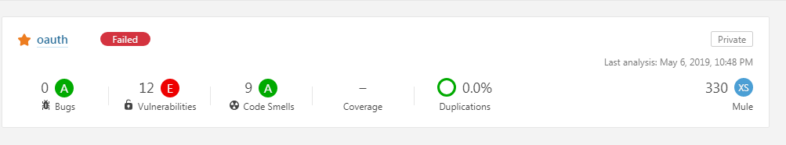<figcaption></figcaption></figure>

### See Also

* [Source Code Analysis - Auto Fix Issues](anypoint-studio-autofix.md)
* [Rules Playground - Custom Rules Editor](anypoint-studio-rules-playground.md)
