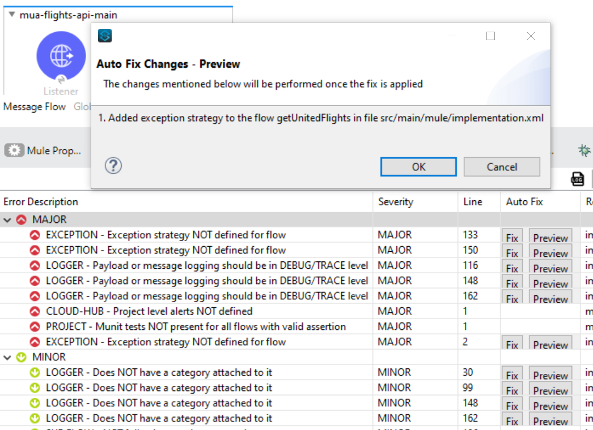
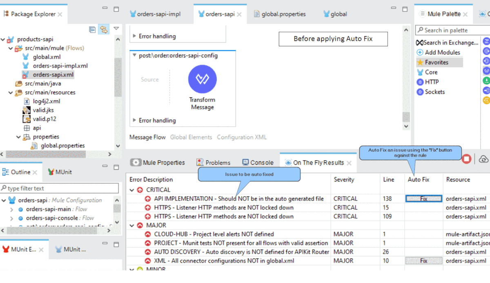
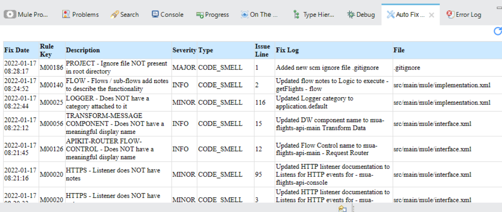

# Anypoint Studio - Autofix

Autofix is a feature where static code analysis issues can be fixed automatically with the click of a button.


Make sure you have:

* Installed the latest version of [IZ Scan - Anypoint Studio Studio Plugin](../installation/install-iz-analyzer-studio.md)
* Configured the plugin with the appropriate connection type, Service URL, and Access Token.
* Valid license with Auto Fix module enabled


### Enable Autofix

1. Go to **`Window`** -> **`Preferences`** -> **`IZ Preferences`**, and **`Sync Metadata`** if not done already
2. Click on **`Enable Auto Fix`**

### Autofix Issues

1. Go to **`Window`** -> **`Show View`** -> **`other`** -> **`IZ Scan`** -> select **`On the Fly Results`**
2. **`Preview`** and **`Fix`** options will be available in **`On the Fly Results`** table against applicable rules
3.  Use the **`Preview`** option to view the list of changes that the **`Fix`** would perform. No files will be updated in preview mode.\
    &#x20;

    <figure><figcaption></figcaption></figure>
4.  Use the **`Fix`** option to apply the fix to applicable files  

    <figure><figcaption></figcaption></figure>

### Autofix - Logs

1. Go to **`Window`** -> **`Show View`** -> **`other`** -> **`IZ Scan`** -> select **`Auto Fix Logs`**
2. An audit log of the applied fix will be generated in the **`target/izanalyzer/autofix-log.csv`** directory
3.  HTML report of the same will be displayed in **`Auto Fix Logs`** view\
    &#x20;

    <figure><figcaption></figcaption></figure>

#### See Also

* [On The Fly Results](anypoint-studio-analysis.md)
* [Rules Playground - Custom Rules Editor](anypoint-studio-rules-playground.md)
