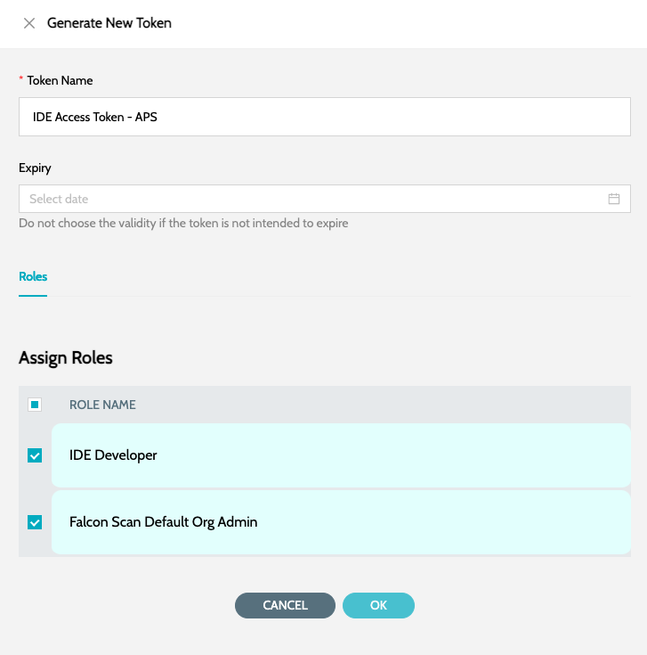
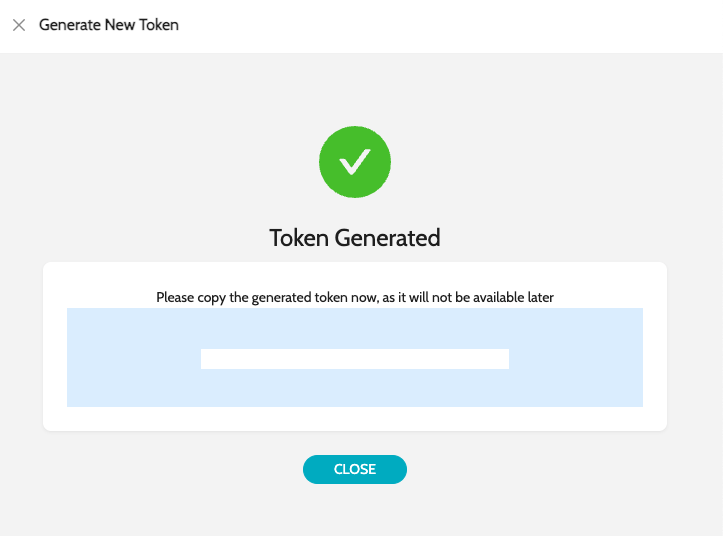
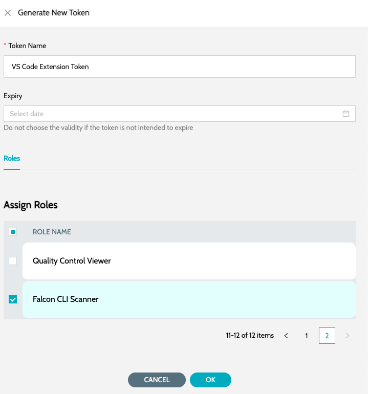
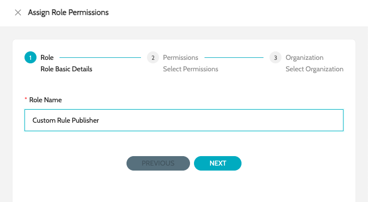
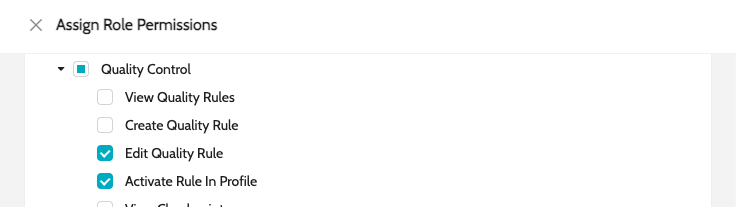
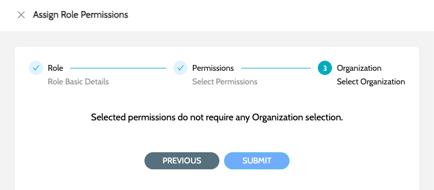

# Generate Security Token

### Generate Security Token - IDE

1.  Security token for configuring **`Access Tokens`** in either `Anypoint Studio` or `VS Code` can be generated from the **`IZ Server`** by following below steps -

    1. Login to **`IZ Web Application`**. The URL will differ for hybrid and on-premise installations.
    2. Navigate to **`My Account`** main menu. If you are an admin and trying to generate a token on behalf of other user navigate to **`Organization`** main menu -> **`Tokens`**
    3. Click on **`Generate Token`**, enter the token name and select **`IZ IDE Developers`** role. Assign **`Custom Rule Publisher`** role if applicable for the token, which will be used to publish custom rules.

    \
    

    d.Click **`Ok`** to generate the token. Copy the token and save it securely as the token will not be displayed again.&#x20;

<figure><figcaption></figcaption></figure>

**`NOTE:`** If the Global Setting **`IDE Settings`** -> **`Show All Quality Profiles`** value is set to false, make sure to assign roles specific to the organization.

### Generate Security Token - CICD Scans

1. Security token for configuring **`Auth Token`** in CICD scans can be generated from the **`IZ Server`** by following below steps -
   1. Login to **`IZ Web Application`**. The URL will differ for hybrid and on-premise installations.
   2. Navigate to **`Organization`** main menu -> **`Tokens`**
   3. Click on **`Generate Token`**, enter the token name and select **`IZ CLI Scanner`** role.&#x20;

<figure><figcaption></figcaption></figure>

d. Click **`Ok`** to generate the token. Copy the token and save it securely as the token will not be displayed again.&#x20;

<figure><figcaption></figcaption></figure>

### Custom Rule Publisher Role

1. Navigate to **`Organization`** -> **`Roles`** and click on **`Create Role`**
2. Enter the **`Role Name`** and click on next. For example - Custom Rule Publisher&#x20;

<figure><figcaption></figcaption></figure>

3. Select **`Edit Quality Rule`**, **`Activate Rule in Profile`** permissions and click on next&#x20;

<figure><figcaption></figcaption></figure>

4. Submit to create the new role&#x20;

<figure><figcaption></figcaption></figure>
