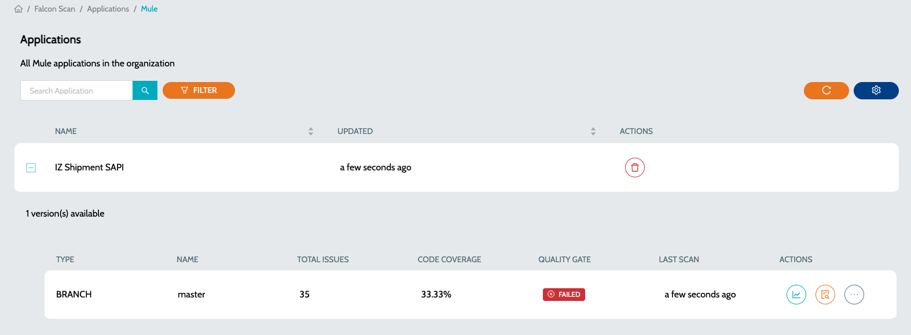

# Mule Coverage Reports

## Mule - Code Coverage Reports


* IZ Scan does not execute MUnit tests or produce coverage reports. Instead, it solely imports pre-generated reports in JSON format.


### How to generate a coverage report

1. The Coverage Report should be configured in JSON format for IZ Scan to scan and upload the report. Refer to [Maven Configuration for Coverage](using-maven.md).
2. Before scanning the project, make sure MUnit test cases are executed and the coverage report is generated.

### Coverage report upload

1. IZ Scan parses the JSON coverage report from the default path **`target/site/munit/coverage/munit-coverage.json`**. No additional configuration parameters are required to enable scanning of coverage reports
2.  On successful analysis, the coverage report will be uploaded to the server with the following statistics -

    1. Overall coverage percentage - Click on the actions and select **`Code Coverage Report`**&#x20;

    <figure><figcaption></figcaption></figure>

    b. File and flow level coverage percentage&#x20;

    <figure><figcaption></figcaption></figure>

&#x20;      c. Uncovered and covered lines&#x20;

<figure><figcaption></figcaption></figure>

### See Also

* [Install IZ Scan for Cloud](../vs-code-extension/installation/cloud-version.md)
* [Install IZ Scan for Desktop](../vs-code-extension/installation/desktop-version.md)
* [Aborting Builds](terminate-build.md)

