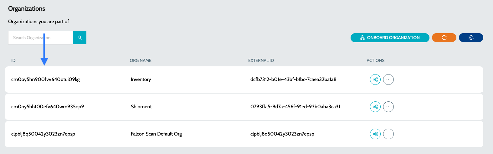

# Using Maven

## CICD Integration - Using Maven


Before scanning applications using IZ Scan, make sure you have:

* Purchased a valid license for IZ Scan.
* Downloaded and installed **`Apache Maven`** 3.6.3 or higher. Refer to [Installing Apache Maven](https://maven.apache.org/)
* Downloaded and installed JDK 11
* Follow the instructions on [Generating Security Token](generate-security-token.md) to generate a security token


### Adding Repositories

1. The binaries required to scan the projects are available in **`IZ Maven Central`** repository. Include the following repositories and plugin repositories in settings.xml

```xml
&lt;repositories>
    &lt;repository>
        &lt;id>iz-maven-repo&lt;/id>
        &lt;name>IZ Maven Repo&lt;/name>
        &lt;url>https://iz-public-m2.s3.eu-west-2.amazonaws.com/releases&lt;/url>
    &lt;/repository>
&lt;/repositories>
```

```xml
&lt;pluginRepositories>
    &lt;pluginRepository>
        &lt;id>iz-maven-plugin-repo&lt;/id>
        &lt;url>https://iz-public-m2.s3.eu-west-2.amazonaws.com/releases&lt;/url>
    &lt;/pluginRepository>
&lt;/pluginRepositories>
```

### CI/CD Integration

1. Go to the project root directory from the command line/terminal
2. Run **`mvn com.integralzone.iz:iz-scan-cli:scan`** command with the following options
   1. -DserviceHost=xxx\
      &#xNAN;_&#x49;Z Scan service URL_
   2. -DauthToken=xxx\
      &#xNAN;_&#x53;ecurity token generated from the server_
   3. -DapplicationKey=x.x\
      &#xNAN;_&#x55;nique ID of the application / project being scanned_
   4. -DapplicationName=.\
      &#xNAN;_&#x4E;ame of the application being scanned_
   5. -Dsource=xxx\
      &#xNAN;_&#x4F;ptional. Location of the project source directory. If ignored, the current directory will be used as the project source directory_
   6. -DscmBranchName=xxx + _Optional. SCM branch for which code is being analyzed. If ignored, the default value will be **`master`**_
   7. -DpullRequestId=xxx + \_Optional.SCM Pull request name for which code is being analyzed
   8. -Dorganization=xxx + _Optional. Organization under which the project should be categorized. If ignored, the default organization will be used. Value can be any of Organization Name / Id / Ext Id_
   9. -DsarifReport=xxx + \_Optional. Used to generate issues in SARIF format. The output report file path must be specified using this parameter.

Please refer to the section [below](using-maven.md) for instructions on how to retrieve the organization ID.

1. A complete example may look like&#x20;

```
PROJECT_ROOT_DIR> mvn com.integralzone.iz:iz-scan-cli:scan 
-DserviceHost=${FALCON_HOST} 
-DauthToken=${FALCON_TOKEN} 
-DapplicationKey=orders-sapi 
-Dsource=.
-DapplicationName="Orders SAPI"
```

### Retrieve Organization ID

1. Navigate to the main menu **`Organizations`** -> **`Organizations`**
2. In the displayed list of organizations, each one will have an associated **`Id`** as shown below.&#x20;

<figure><figcaption></figcaption></figure>

3. Use the Organization ID when performing the CICD scan with the **`-Dorganization`** parameter.

```
_For example: -Dorganization=cm0oy5hht00efv640wm935np9_
```

### Setting Proxy Details

If the system from which the projects are analyzed is configured with a proxy, then set the following arguments with proxy server details -

1. Windows&#x20;

```
-Dhttps.proxyHost=PROXY_HOST -Dhttps.proxyPort=PROXY_PORT -Dhttp.proxyHost=PROXY_HOST -Dhttp.proxyPort=PROXY_PORT -Djava.net.useSystemProxies=true
```


* Replace **`PROXY_HOST`** and **`PROXY_PORT`** with appropriate values for Porxy server host and port
* If **`https.proxyPort`** is not specified default value will be 443
* If **`http.proxyPort`** is not specified default value will be 80


### See Also

* [Mule Code Coverage](page-2.md)
* [Aborting Builds](terminate-build.md)
* [Install IZ Scan for Cloud](../vs-code-extension/install-vs-code-extension-cloud.md)
* [Install IZ Scan for Desktop](../vs-code-extension/install-vs-code-extension-desktop.md)

