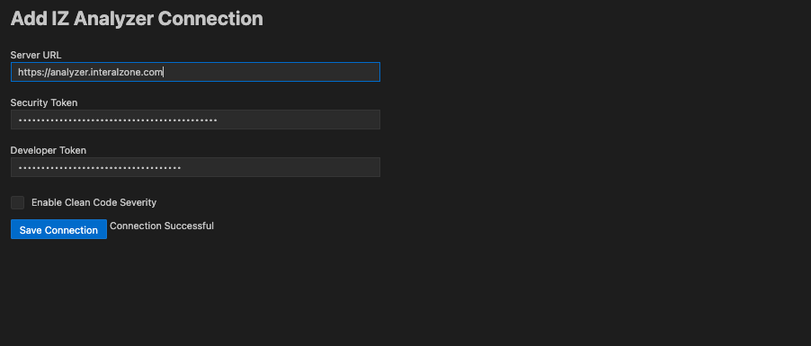
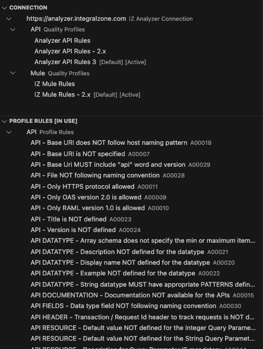

# Analyzer Configuration

## IZ Analyzer Configuration


Before installing and using IZ Scan VS Code Extension, make sure you have:

* Purchased a valid license for Mule Scanner or API Scanner or both.
* A valid developer token shared as part of the license.


### Connection Setup

1. Click on the "IZ" icon from the activity bar
2.  Click on "IZ Analyzer Connection" to connect to IZ Analyzer\
    &#x20;

    <figure><figcaption></figcaption></figure>
3.  Enter the Service URL, Security Token, Developer Token, and click on _**Save Connection**_. Service URL to connect to IZ Analyzer cloud is https://analyzer.integralzone.com. The service URL will differ for hybrid or on-premises installations.\
    &#x20;

    <figure><figcaption></figcaption></figure>
4.  Once the connection is established, the Quality Profiles and corresponding rules will be loaded from the configured server\
    &#x20;

    <figure><figcaption></figcaption></figure>

### See Also

* [Install IZ Scan for Cloud](install-vs-code-extension-cloud.md)
* [Install IZ Scan for Desktop](install-vs-code-extension-desktop.md)
