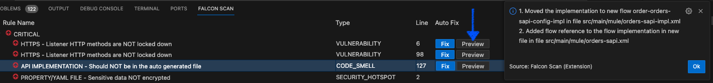
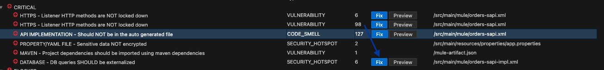
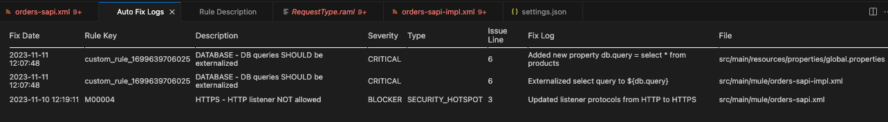

# Autofix

## Autofix - Issues

Autofix is a feature, where static code analysis issues can be fixed automatically with the click of a button.


Make sure you have:

* Installed and configured [IZ Scan Extension](iz-scan-extension-configuration.md).
* Purchased a valid license or generated a trial license for Mule Scanner or API Scanner or both.


### Autofix Issues

1.  Navigate to **`IZ Scan`** tab in the panel or use `Ctrl+Shift+P` (Cmd+Shift+P on macOS) and search for **`IZ Scan: Fly Results`** to open the view\
    &#x20;

    <figure><figcaption></figcaption></figure>
2. **`Preview`** and **`Fix`** options will be available in **`On the Fly Results`** table against applicable rules
3.  Use the **`Preview`** option to view the list of changes that the **`Fix`** would perform. No files will be updated in preview mode  

    <figure><figcaption></figcaption></figure>
4.  Use the **`Fix`** option to apply the fix to applicable files\
    &#x20;

    <figure><figcaption></figcaption></figure>

### Autofix - Logs

1. Use `Ctrl+Shift+P` (Cmd+Shift+P on macOS) and search for **`>IZ Scan: Auto Fix Logs`** to open the view
2. An audit log of the applied fix will be generated in the **`target/izanalyzer/autofix-log.csv`** directory
3.  HTML report of the same will be displayed in **`Auto Fix Logs`** view  

    <figure><figcaption></figcaption></figure>

### See Also

* [Fly Results](fly-results.md)
