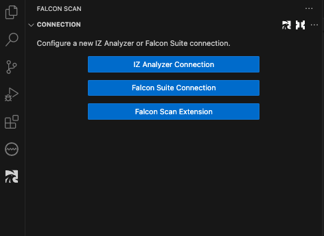
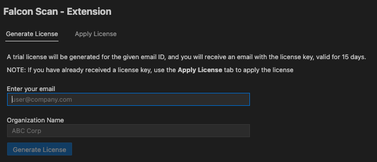
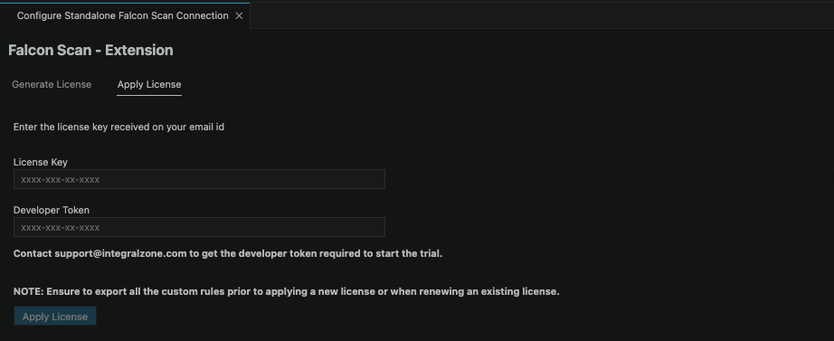
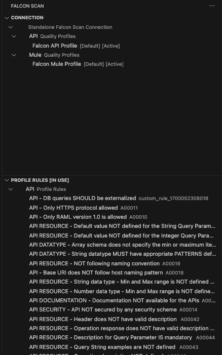

# IZ Scan Extension

### Generate License

1. Click on the "IZ" icon from the activity bar
2.  Click on **`IZ Scan Extension`** to request a trial license

    <figure><figcaption></figcaption></figure>
3.  Enter the Email ID, Company Name, and click on **`Generate License`** 

    <figure><figcaption></figcaption></figure>
4. A trial license will be generated for 15 days, and the license key will be sent to the email ID

### Apply License

1. Enter the license key shared in the email.
2.  Contact support@integralzone.com to get the developer token required to start the trial.

    <figure><figcaption></figcaption></figure>
3. Click on **`Apply License`**
4.  Once the license is applied, the Quality Profiles and corresponding rules will be loaded.

    <figure><figcaption></figcaption></figure>
5. [IZ Scan - Fly Results](../source-code-analysis/on-the-fly-results.md) provides real-time visibility into project issues.

### See Also

* [Install IZ Scan for Cloud](../installation/cloud-version.md)
* [Install IZ Scan for Desktop](../installation/desktop-version.md)
