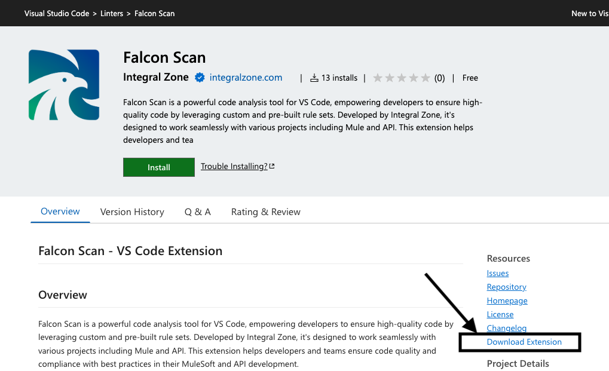
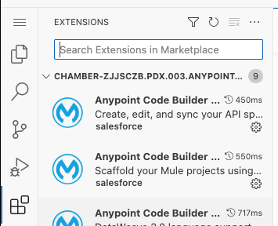
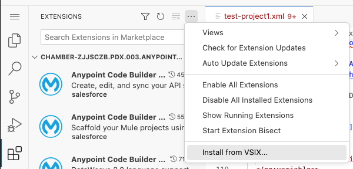
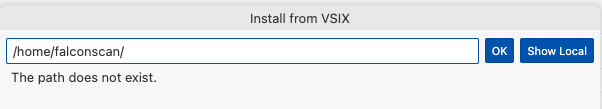

# Install VS Code Extension - Cloud

### Install Plugin

1.  Navigate to **`IZ Scan`** extension in [Visual Studio Marketplace](https://marketplace.visualstudio.com/items?itemName=integralzone.iz-scan)\
    &#x20;

    <figure><figcaption></figcaption></figure>
2. Click on **`Download Extension`** to download the extension (.vsix file)
3.  Navigate to **`Extension`** from VS Code Cloud activity bar\
    &#x20;

    <figure><figcaption></figcaption></figure>
4.  Click on **`Install from VSIX`**\
    &#x20;

    <figure><figcaption></figcaption></figure>
5.  Click on **`Show Local`** and select the locally downloaded .vsix file from Step-1  

    <figure><figcaption></figcaption></figure>

### See Also

* [Install IZ Scan for Desktop](install-vs-code-extension-desktop.md)
* [IZ Analyzer Configuration](analyzer-configuration.md)
* [IZ Scan Extension Configuration](iz-scan-extension-configuration.md)
