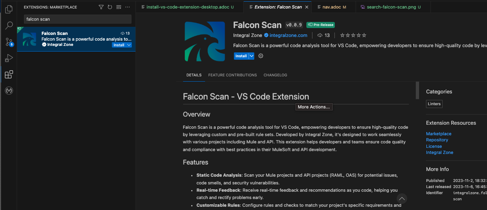
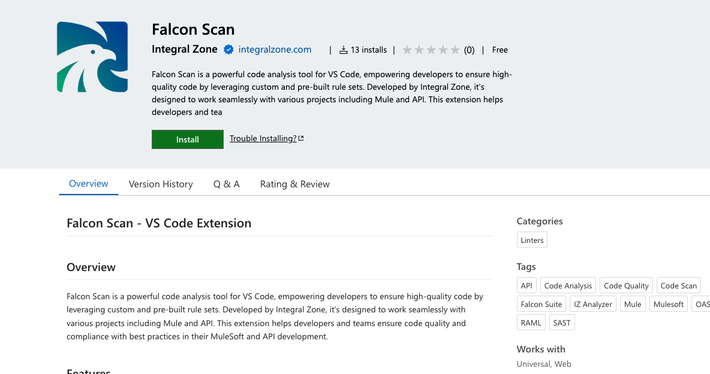

# Desktop Version

### Install Plugin

1.  Navigate to **`Extensions`** and search for _**IZ scan**_ and click on **`Install`**  

    <figure><figcaption></figcaption></figure>
2.  **`IZ Scan`** extension can also be installed from the [Visual Studio Marketplace](https://marketplace.visualstudio.com/items?itemName=integralzone.iz-scan). Clicking on **`Install`** button will open the extension installation page in VS Code.  

    <figure><figcaption></figcaption></figure>
3. Restart VS Code after installation

### See Also

* [Install IZ Scan for Cloud](cloud-version.md)
* [IZ Analyzer Configuration](../configuration/iz-analyzer.md)
* [IZ Scan Extension Configuration](../configuration/iz-scan-extension.md)
