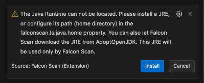

# Prerequisites


* The IZ Scan VSCode Extension plugin requires Java version 11 or higher, but no greater than Java 21


Java installation will be checked in the following order, and if none of them are found, a prompt will be issued to install Java, which will be used exclusively by the IZ Scan Extension.

### Installation availability in the command line

1. Checks whether Java version is already installed and available as part of the command line command. The following command will be executed to check the Java installation: > java -version openjdk version "11.0.15" OpenJDK Runtime Environment Homebrew (build 11.0.15+0) OpenJDK 64-Bit Server VM Homebrew (build 11.0.15+0, mixed mode)

### JAVA\_HOME environment variable

1. Validates whether the **`JAVA_HOME`** environment variable is configured, and if configured, ensures that the Java version meets the specified requirements.

### Java Home directory from settings

1. Validates whether the Java home path is configured as part of the **`izscan.ls.java.home`** variable in user settings.
2. Use `Ctrl+Shift+P` (Cmd+Shift+P on macOS) and search for `User Settings (JSON)` to open the view.

### Install Java to be used by IZ Scan Extension

1.  If a valid version of Java is not found from any of the above steps, a prompt will be shown to install the required Java version.

    <figure><figcaption></figcaption></figure>
2. Click on "Install" to proceed with the Java installation, and once completed, restart the Visual Studio instance.

### See Also

* [Install IZ Scan for Desktop](desktop-version.md)
* [Install IZ Scan for Cloud](cloud-version.md)
* [IZ Analyzer Configuration](../configuration/iz-analyzer.md)
