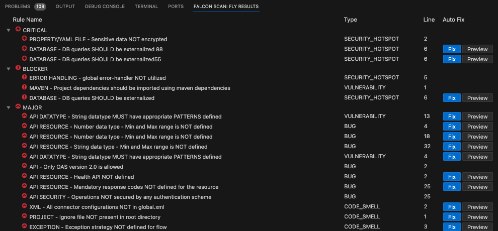
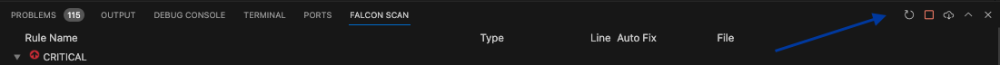
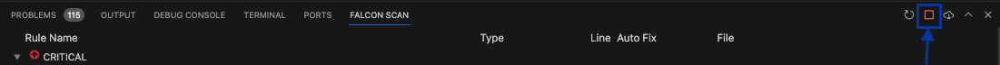
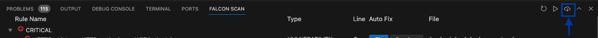
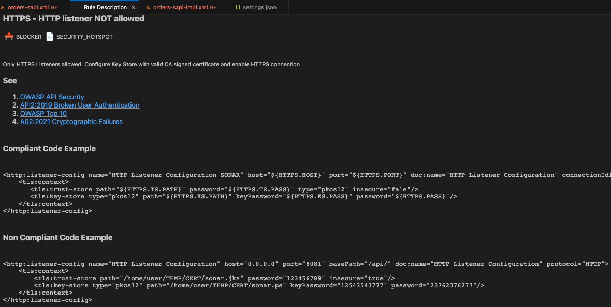

# On The Fly Results


Before analyzing the source code in VS Code, make sure you have

* Installed and configured [IZ Scan Extension](../configuration/iz-scan-extension.md).
* Purchased a valid license or generated a trial license for Mule Scanner or API Scanner or both.


### On The Fly Results:

**`On The Fly Results`** table/view will display the issues related to the project that a user is working on. Project is determined based on the current active file (i.e., the file that user is working on).\
Issues will be detected and reported as and when the connectors/components are configured in the project. With this, the issues can be fixed even before they exist.\
Follow the steps below to explore **`On The Fly Results`** view.

1.  Navigate to **`IZ Scan`** tab in the panel or use `Ctrl+Shift+P` (Cmd+Shift+P on macOS) and search for **`IZ Scan: Fly Results`** to open the view 

    <figure><figcaption></figcaption></figure>

    * NOTE: **`On The Fly Results`** scans the whole project and displays the results

### On The Fly Results - Settings

The Results tab provides options such as start or stop analysis, sync rules from the server, reload on the fly results.

1.  In the **`IZ Scan`** tab, all the options are displayed at the top right corner. 

    <figure><figcaption></figcaption></figure>
2.  By default, the analysis is active and will immediately report any issues it sees fit. Clicking on the **`Stop Auto Analysis`** will stop the analysis. You can start it at a later time once a part of your development is completed.

    <figure><figcaption></figcaption></figure>
3.  Auto analysis can be turned on by clicking the **`Play`** icon as shown below 

    <figure><figcaption></figcaption></figure>
4.  Your organization might have added new rules or updated the rules in the server. By clicking on the **`Sync Rules`** option, you will be importing these updated rules onto VS Code Extension. 

    <figure><figcaption></figcaption></figure>
5.  By Clicking on **`Reload Analysis Results`** option, your project will be validated against the rules to refresh the tab so as to display any new issues along with the previously displayed issues.

    <figure><figcaption></figcaption></figure>

### Issue Fix Recommendation

**`On The Fly Results`** precisely point out the problem in each file with line number, but many users might not be aware of issue fix.

Issue fix recommendation helps to deal with this scenario with detailed description and examples on how to fix the issue.

1.  Double-click on any issue that needs a fix to open up the **`Rule Description`** view. 

    <figure><figcaption></figcaption></figure>
2. **`Rule Description`** view provides information about:
   1. Type of Issue. E.g., **`Code Smell`**, **`Bug`**
   2. Detailed description of the violated rule/issue
   3. Any OWASP or CWE violations and corresponding links
   4. Noncompliant Code Example
   5. Compliant Code Example, which guides developers on how to fix the issue
   6. Optionally, an external link to any official documentation for further information about the fix

### See Also

* [Auto Fix - Issues](autofix.md)
