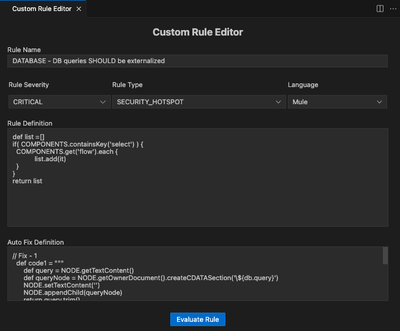
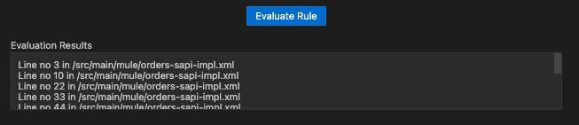
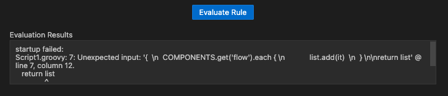
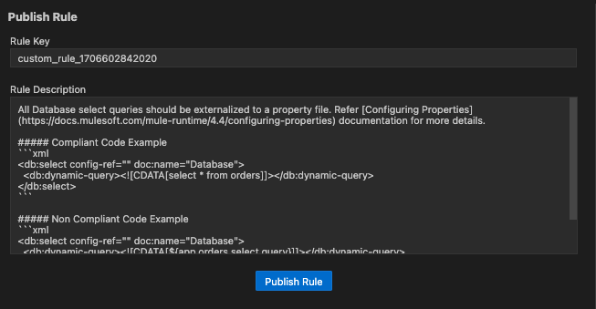

# VS Code Extension - Rules Playground

Rules Playground is a tool for quick and easy development of **`Custom Rules`**


Before analyzing the source code in VS Code, make sure you have

* Installed and configured the [IZ Scan Extension](install-vs-code-extension-desktop.md).
* Purchased a valid license or generated a trial license for IZ Scan.


### Features:

1. Develop/Create a custom rule definition and evaluate against the project.
2. Provides feedback about any syntax errors in the rule definition.
3. Capability to evaluate the rule definition on Mule components, APIs, property files, pom.xml, etc.
4. Publish the rule definition to the configured server and activate it.

### Custom Rule Editor:

5. Use `Ctrl+Shift+P` (Cmd+Shift+P on macOS) and search for **`IZ Scan: Custom Rule Editor`** to open the view
6. Custom rule editor properties -
   1. **`Rule Name`** - Name of the new custom rule
   2. **`Rule Type`** - Select the type of rule, which can be one of
      1. Code Smell
      2. Bug
      3. Vulnerability
      4. Security Hotspot
   3. **`Rule Severity`** - Select the rule severity, which can be one of
      1. Blocker
      2. Critical
      3. Major
      4. Minor
      5. Info
   4. **`Language`** - Language for which the rule is being developed / published, which can be one of
7. Mule - Custom rule for Mule components
8. API - Custom rule for APIs (i.e. RAML or OAS specs)
   1.  **`Rule Definition`** - Groovy definition for the custom rule

       <figure><figcaption></figcaption></figure>

### Evaluating Custom Rule:

1. Click on **`Evaluate Rule`** button to validate and execute the rule definition
2. Custom rule will be applied on the current project and results will be displayed in **`Evaluation Results`** section
3.  Results in case of valid rule definition

    <figure><figcaption></figcaption></figure>
4.  Results in case of syntax errors in the rule definition

    <figure><figcaption></figcaption></figure>

### Publishing Custom Rule:


Before publishing a custom rule, make sure you have:

* Created a custom Quality Profile from the default Profile.
* Appropriate access to the server to publish the rule.


1. Expand the **`Publish Rule`** section
2. Enter the Rule Key and Description -
   1. **`Key`** - Unique key for the custom rule. The key will be auto-populated, which can be changed if there are any conflicts
   2.  **`Description`** - Description of the rule. Markdown syntax can be used to describe the rule

       <figure><figcaption></figcaption></figure>
3. Click on **`Publish Rule`** to upload the rule to the configured server. The rule will be activated in the selected Quality Profile.
