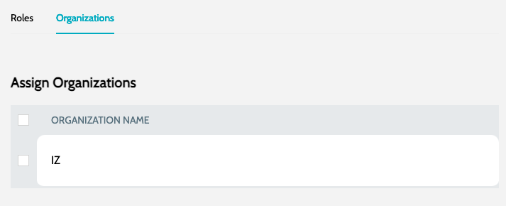

# Invite User

Invite user to the organization:

1. Navigate to **`Organization`** -> **`Users`** and click on **`Invite User`**
2. Enter the basic details:&#x20;

<figure><figcaption></figcaption></figure>

&#x20; a. **`User Name`** - Name of the user

&#x20; b. **`User Email`** - Email of the user. User should sign-in using the account linked to same email id

3. Choose the roles to be assigned to the user&#x20;

<figure><figcaption></figcaption></figure>

4. Choose the organizations users should be part of&#x20;

<figure><figcaption></figcaption></figure>

5. Click on **`Submit`** to invite the user

### See Also

* [Organizations](organizations.md)
* [Users](users.md)
* [Roles](roles.md)
