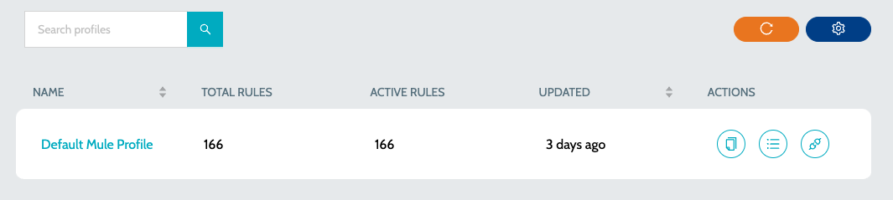
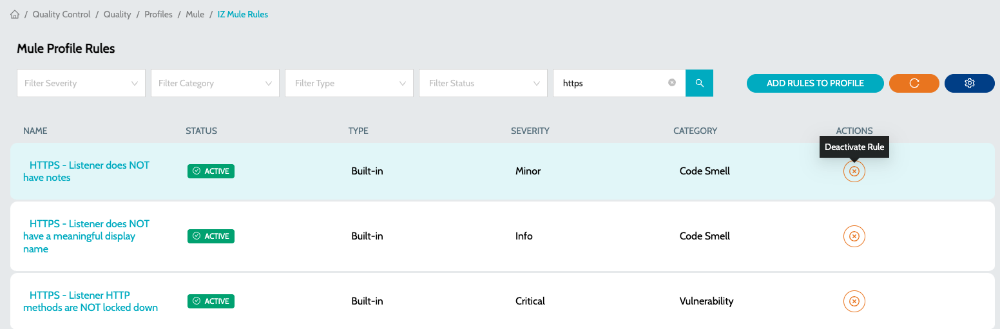
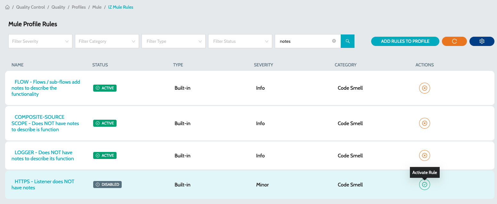

# Rule Activate and De-activate

A quality profile comprises a set of rules that are employed during the process of scanning an application.

### Deactivate Rule in Quality Profile

1.  Navigate to **`Quality Control`** -> **`Quality Profiles`** and select the language specific profile. E.g.: Mule Rule Profiles, API Rule Profiles  

    <figure><figcaption></figcaption></figure>
2. Click on **`View Rules`** action to view the list of available rules in the profile
3.  Search for the rule to be deactivated and click on the **`Deactivate Rule`** action item to deactivate the rule in profile\
    &#x20;

    <figure><figcaption></figcaption></figure>

### Activate Rule in Quality Profile

1.  Navigate to **`Quality Control`** -> **`Quality Profiles`** and select the language specific profile. E.g.: Mule Rule Profiles, API Rule Profiles\
    &#x20;

    <figure><figcaption></figcaption></figure>
2. Click on **`View Rules`** action to view the list of available rules in the profile
3.  Search for the rule to be activated and click on the **`Activate Rule`** action item to deactivate the rule in profile\
    &#x20;

    <figure><figcaption></figcaption></figure>

### See Also

* [Metric Profiles](metric-profiles.md)
* [Quality Rules](../rules/quality-rules.md)
* [Metric Rules](../rules/metric-rules.md)
