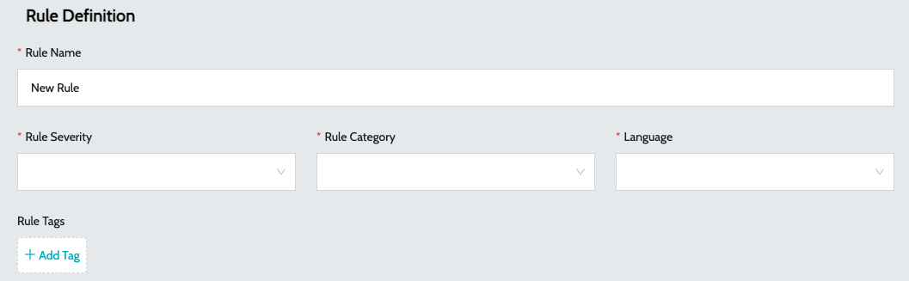
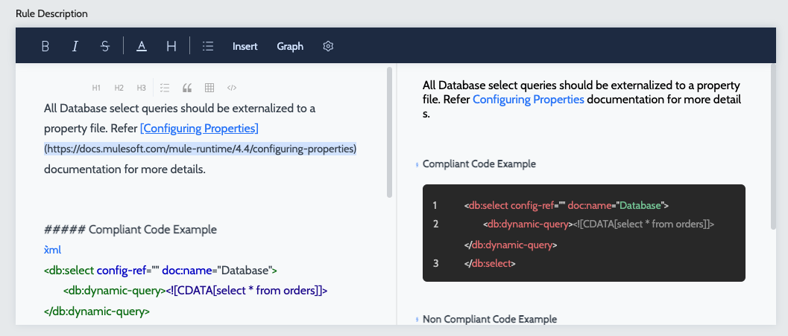
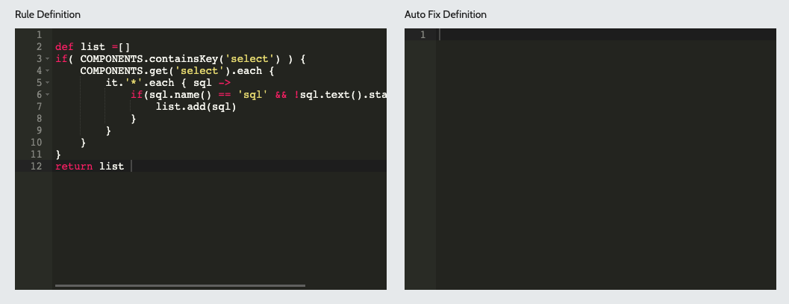

# Clone Built-in Rule

By default, the **`Name`**, **`Severity`**, and **`Category`** of the built-in rules can be updated by users with appropriate permissions. Editing the rule definition or autofix definition of a built-in rule is not allowed. This section covers the details on edit the definition of a built in rule

By default, users with the appropriate permissions can update the **`Name`**, **`Severity`**, and **`Category`** of built-in rules to better align with their organization’s standards.

However, modifying the core rule definition or its autofix logic is not permitted, ensuring the integrity and consistency of the built-in rules. This section outlines the details for editing the configurable attributes of a built-in rule.

### Role required to Clone a built-in Rule -

1. Navigate to **`Organization`** -> **`Users`**.
2. Click on the **`Edit Permissions`** action item of the user who requires the clone rule permission
3. Click on **`Assign Permissions`** and select **`Clone Builtin Rule`** permission.
4. Click on save to apply the permission to the user.

### Clone built-in new Rule -

1. Navigate to **`Rules`** -> **`Quality Rules`**
2. Once the **`Clone Builtin Rule`** permission is assigned to the user, a new action item called **`Clone Rule`** will be enabled for all built-in rules.
3. Click on **`Clone Rule`** action item against the rule which requires customization.
4. Enter the basic details -
   1. **`Rule Name`** - Name of the rule
   2. **`Rule Severity`** - Severity of the rule
   3. **`Rule Category`** - Category of the rule
   4.  **`Rule Tags`** - Tags associated with the rule. Tags can be used to filter issues\
       &#x20;

       <figure><figcaption></figcaption></figure>
   5.  **`Rule Description`** - Description of the rule in Markdown format\
       &#x20;

       <figure><figcaption></figcaption></figure>
   6. **`Rule Definition`** - Definition of the rule. Rules are specified in Groovy
   7.  **`Auto Fix Definition`** - Auto Fix Definition of the rule. Rules are specified in Groovy\
       &#x20;

       <figure><figcaption></figcaption></figure>
5. Click on **`Submit`** to create the rule definition.
6. Once the rule is created, it can be added to the desired quality profile for use during analysis.

### See Also

* [Quality Profiles](../profiles/quality-profiles.md)
* [Metric Profiles](../profiles/metric-profiles.md)
* [Quality Rules](quality-rules.md)
* [Metric Rules](metric-rules.md)
