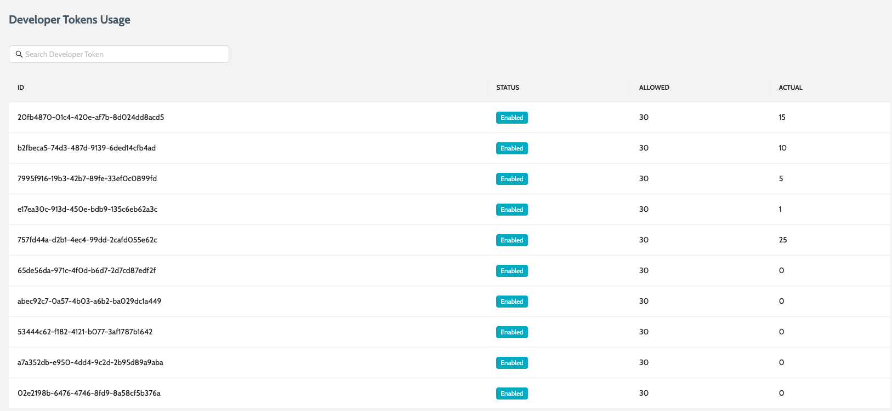
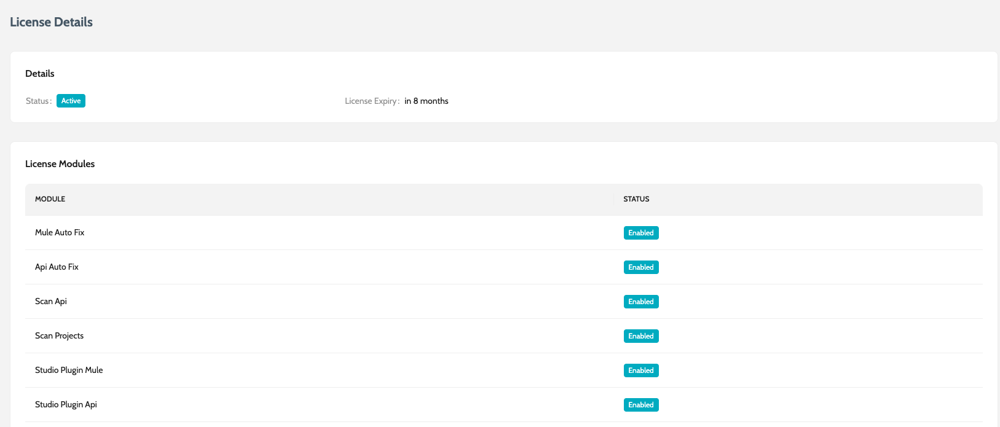

# License Usage

IZ Analyzer license details and developer keys usage are available at [https://license-usage.integralzone.com](https://license-usage.integralzone.com/). Sign in to the application using the license key issued by Integral Zone.

### Developer Keys

Provides a centralized view of all IDE developer keys associated with a subscription. It is intended for administrators to check developer key usage independently.

1. Maintain an inventory of issued IDE developer keys
2. Identify keys that are fully utilized, underutilized

<figure><figcaption></figcaption></figure>

### License Details

Provides a consolidated view of the license subscription, its validity and entitlement limits.

<figure><figcaption></figcaption></figure>

### See Also

* Code Analysis In Anypoint Studio

***

[SonarQube™](https://www.sonarqube.org) is a trademark belonging to SonarSource SA. For further information, please visit [www.sonarqube.org](https://www.sonarqube.org).
