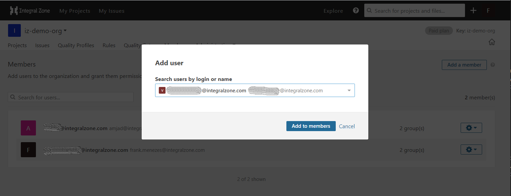
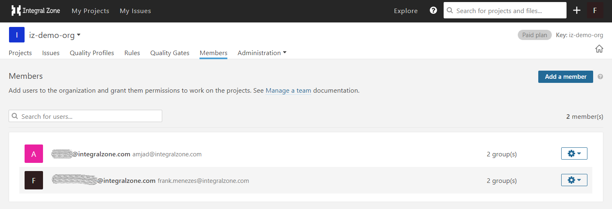
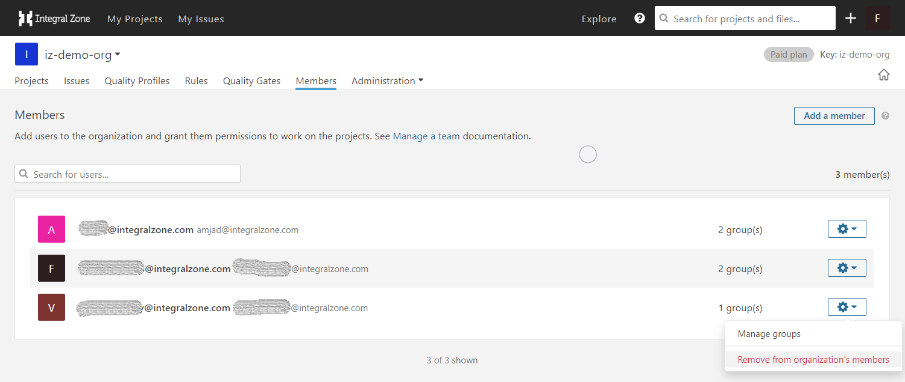

# Add or Remove Members

## Manage Organization in Server

### Add new members to the Organization:

1. Browse to [IZ Analyzer](https://analyzer.integralzone.com/) -> **`Login with your credentials`**. +
2.  Click on the profile icon -> Select your organization under **`My Organizations`** -> click on **`Members`** menu -> Search users by login or name\
    &#x20;

    <figure><figcaption></figcaption></figure>
3.  Confirm by clicking **`Add to members`** button.\
    &#x20;

    <figure><figcaption></figcaption></figure>

### Remove existing members from Organization

1. Browse to **`[IZ Analyzer](https://analyzer.integralzone.com/)`** -> **`Login with your credentials`**.&#x20;
2.  Click on the profile icon -> Select your organization under **`My Organizations`** -> click on **`Members`** menu -> Click on **`Settings icon`** next to the member you want to remove.\
    &#x20;

    <figure><figcaption></figcaption></figure>
3.  Confirm by clicking **`Remove from Organization’s members`**  

    <figure><figcaption></figcaption></figure>

### See Also

* [Create Organization](create-organization.md)
* Activate Rules
