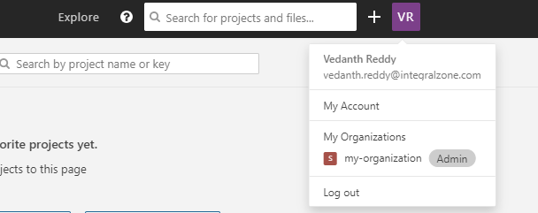
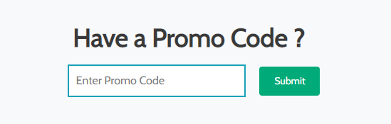

# Apply Promo Code

## Applying Promo Codes


Before applying the promo code, make sure you have:

* A valid promo code shared by IZ team as part of Webinars, Meet-ups, or for any other individual trial purposes.
* Created an organization. Please follow [this document](create-organization.md) to create an organization, if not done already.


### How to apply promo code

1. Browse to **`[IZ Analyzer](https://analyzer.integralzone.com/)`** -> **`Login with your credentials`**. +
2.  Select your organization as shown in the image below.  

    <figure><figcaption></figcaption></figure>
3. Browse to **`Administration`** -> **`Organization Settings`** and select **`Upgrade Now`**&#x20;
4.  You will be taken to organization upgrade page in a new tab. Scroll down to **`Have a Promo Code?`** section and key-in the promo code to activate your trial license. 

    <figure><figcaption></figcaption></figure>

### See Also

* [Code Analysis in Anypoint Studio](../source-code-analysis/code-analysis-in-studio.md)
* [Code Analysis in CICD pipelines](../../integral-zone/iz-analyzer/source-code-analysis/code-analysis-in-cicd.md)
* [Uploading Coverage Reports](../source-code-analysis/coverage-reports.md)
