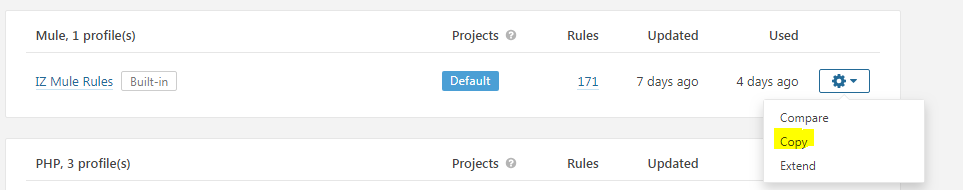
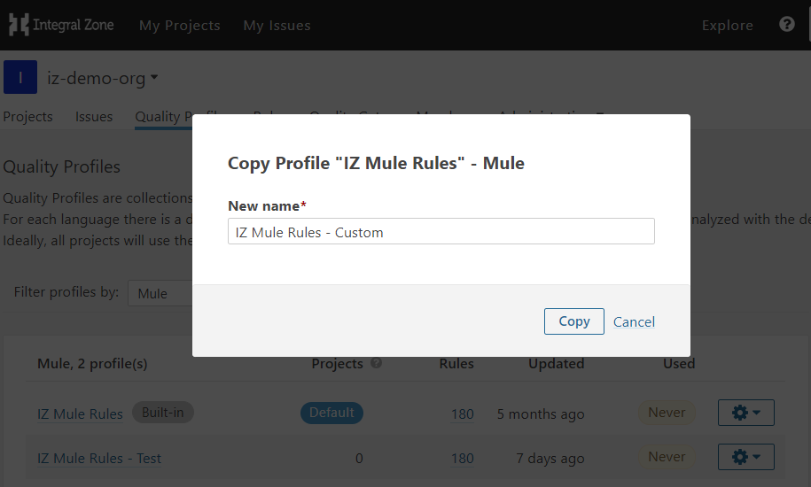
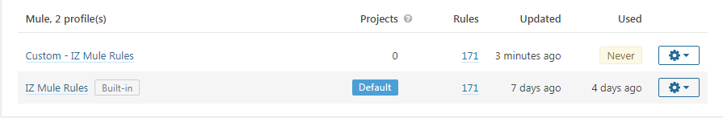
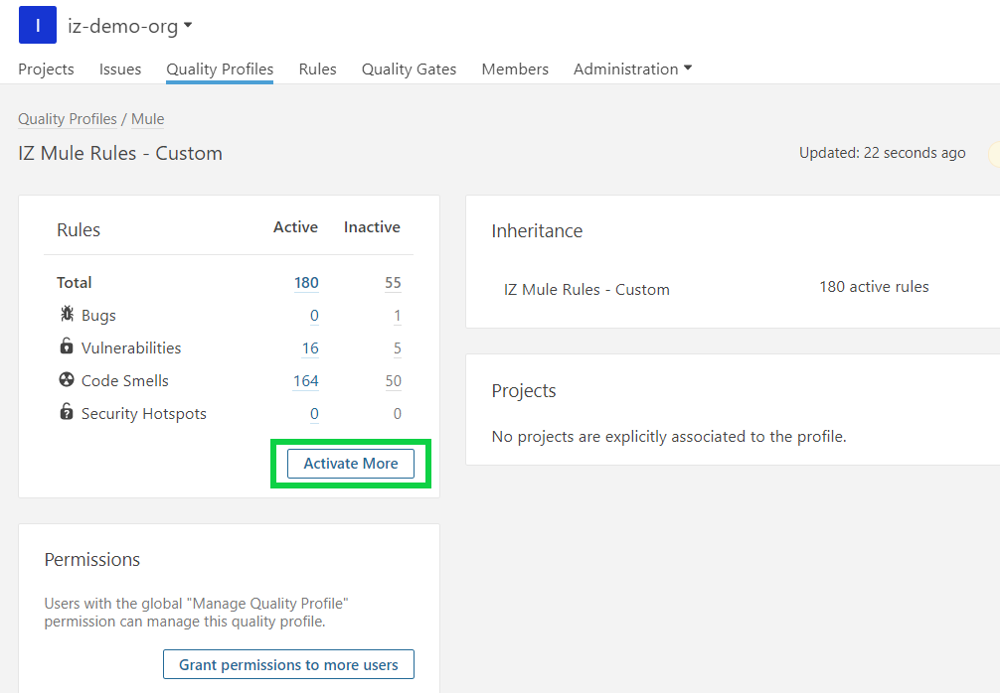
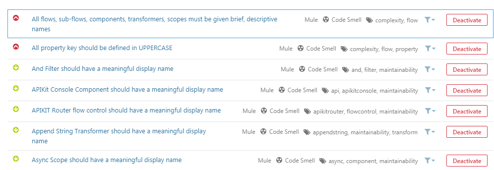
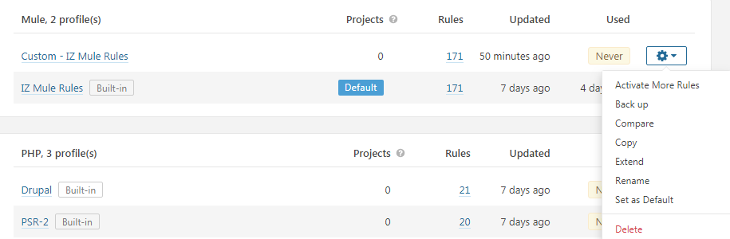

# Deactivate Rules

## Manage Rules in Server


In case of an On-Premises or Hybrid installation model:

* Navigate to your organization-specific service URL instead of [https://analyzer.integralzone.com](https://analyzer.integralzone.com/)
* Choosing an organization will not be required after login


### Create Custom Quality Profile:

1. Browse to **`[IZ Analyzer](https://analyzer.integralzone.com/)`** -> **`Login with your credentials`** -> click on your profile icon -> Select your organization under **`My Organizations`** -> click on **`Quality Profiles`** menu -> Search for **`Mule Profiles`**. +
   * NOTE: There should be one **`Built In`** rule named **`IZ Mule Rules`**, which is the default profile. Rules cannot be activated or de-activated on the **`Built In`** profile. We need to clone/extend the **`Built In`** profile and then activate or de-activate rules.
2.  Click on the **`Settings`** -> **`Copy`**, if not already done 

    <figure><figcaption></figcaption></figure>
3.  Enter a **`New Name`** for the profile -> click on **`Copy`**, if not already done 

    <figure><figcaption></figcaption></figure>

### Deactivate Rules:

1.  Click on the created new profile **`Custom - IZ Mule Rules`** 

    <figure><figcaption></figcaption></figure>
2.  Click on **`Active Rules (Number)`** to deactivate rules which are activated 

    <figure><figcaption></figcaption></figure>
3.  Once all the activated rules are listed, click on the **`Deactivate`** button against each rule to deactivate 

    <figure><figcaption></figcaption></figure>
4. Once all the required rules are deactivated, go back to **`Quality Profiles`** menu -> Search for **`Mule Profiles`** -> **`Settings`** icon -> **`Set as Default`**, if not already done
   *   NOTE: Only the profile marked as **`Default`** will be used for evaluating the rules 

       <figure><figcaption></figcaption></figure>

### See Also

* [Activate Rules](activate-rules.md)
