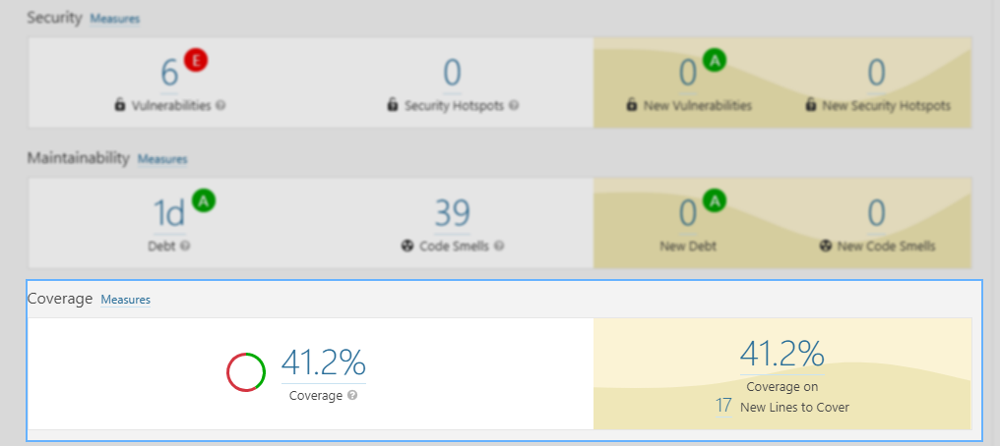
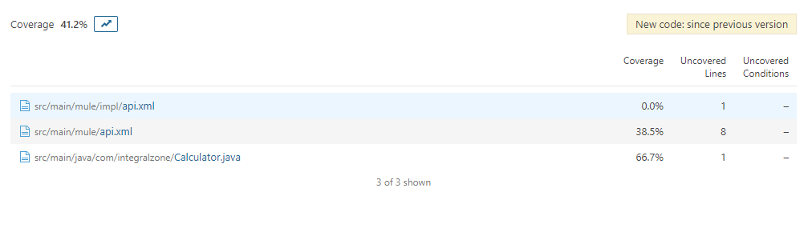
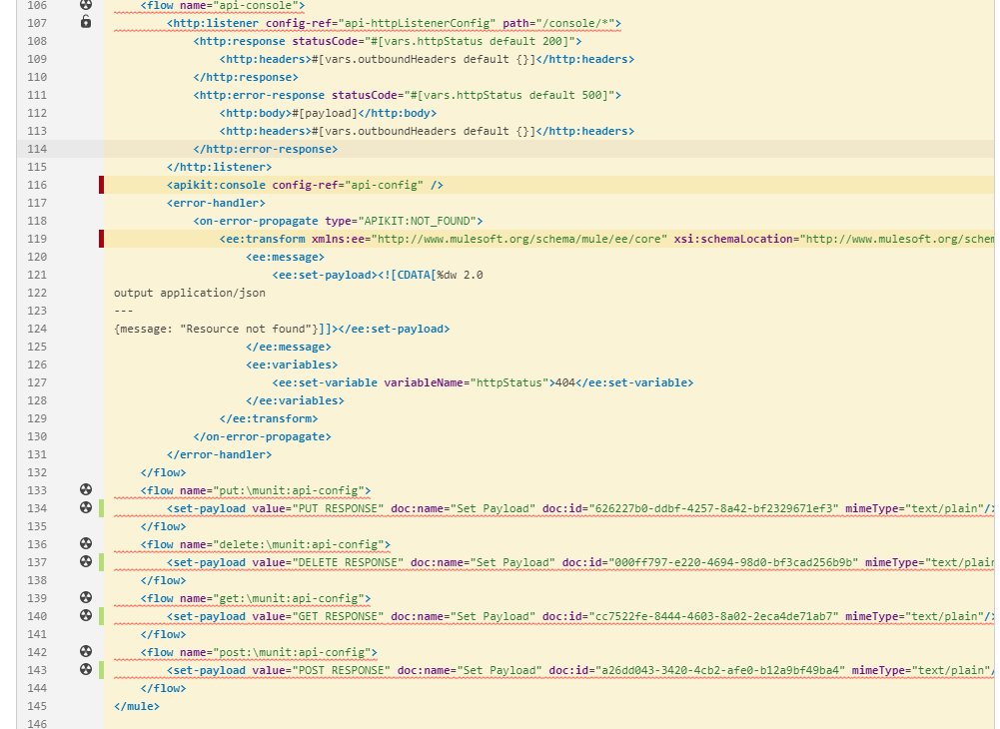

# Coverage Reports

## Uploading Coverage Reports


* IZ Analyzer does not run MUnit tests or generate reports. It only imports the pre-generated reports in Json format.


### How to generate coverage report

1. Coverage report should be configured in JSON format for IZ Analyzer to scan and upload the report. Refer to [Maven Configuration for Coverage](https://docs.mulesoft.com/munit/2.2/coverage-maven-concept).
2. Before scanning the project, make sure MUnit test cases are executed and coverage report is generated.

### Coverage report upload

1. IZ Analyzer scans the coverage JSON report from appropriate locations based on the Mule version. No additional configuration parameters are required to enable scanning of coverage reports
2. Following directories will be scanned for coverage report based on the mule version. (These are the default locations where MUnit coverage reports will be generated) -
   1. Mule 3 **`target/munit-reports/coverage-json/report.json`**
   2. Mule 4 **`target/site/munit/coverage/munit-coverage.json`**
3. On successful analysis coverage report should be uploaded to server with following statistics -
   1.  Overall coverage percentage\
       &#x20;

       <figure><figcaption></figcaption></figure>
   2.  File level coverage percentage\
       &#x20;

       <figure><figcaption></figcaption></figure>
   3.  Flow level coverage details details\
        

       <figure><figcaption></figcaption></figure>

## See Also

* [Code Analysis In Server](../install/install-iz-analyzer-server-plugin.md)
