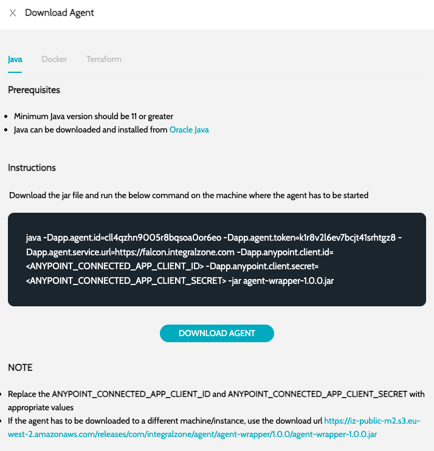

# Self-Hosted Agent


Self hosted agents can be used when you do not want -

1. To share the Anypoint Connected App’s Client Id and Secret
2. The Agent / Workers to download and scan applications on cloud


## Configure Self-Hosted Agent

1. Navigate to **`Global Settings`** -> **`Agents`** and click on **`Configure Agent`**
   1. Specify the agent name. For example: On-Prem Agent
   2. Specify number of worker. For example, a value of 3 indicates that the agent can perform 3 parallel scans/jobs at a time.
   3. Specify the Agent type as **`SELF-HOSTED`**
   4. Select the Job Types handled by agent. If you are not sure, all the available job types can be selected
   5. Click on Submit&#x20;
2. Once the agent is created, click on the **`Download Agent`** action and follow the instructions&#x20;

<figure><figcaption></figcaption></figure>

3. After starting the agent, make sure the agent status is **RUNNING**
4. Re-log in, and start configuring the schedules

### See Also

* [Cloud-Hosted Agent](cloud-hosted-agent.md)
* [Agent Job Types](../../agent-job-types.md)
