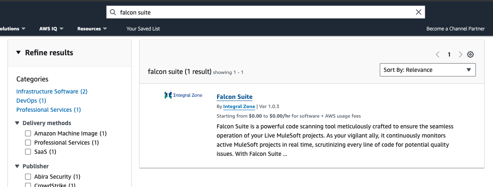
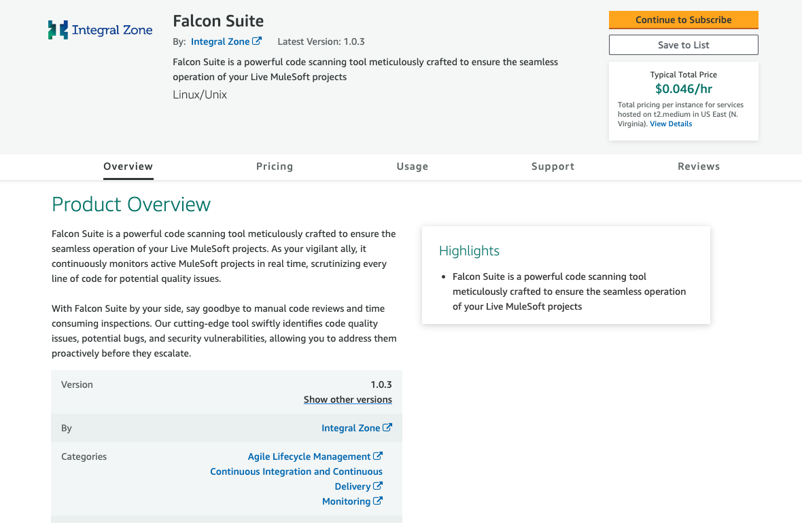
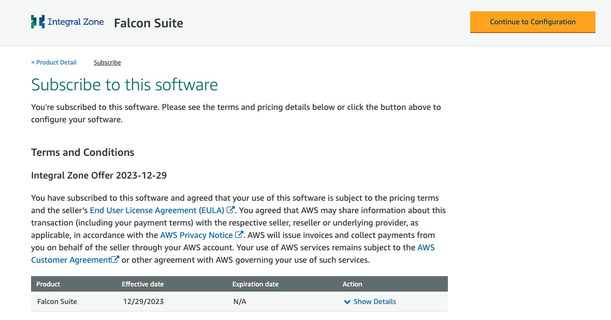
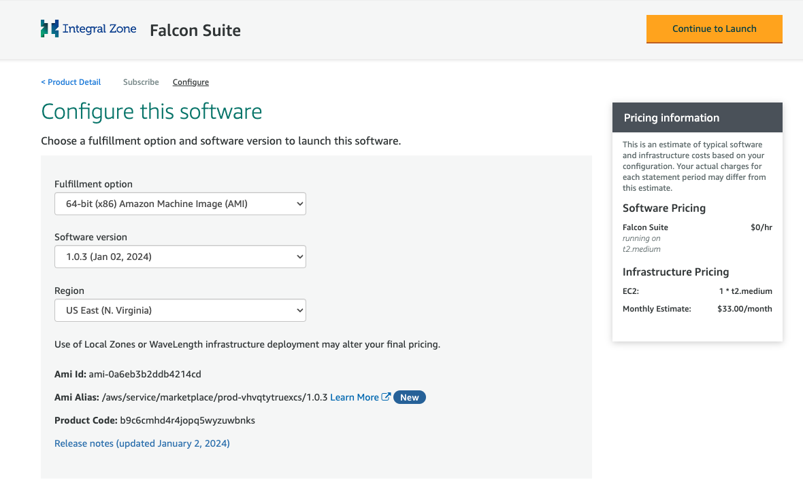
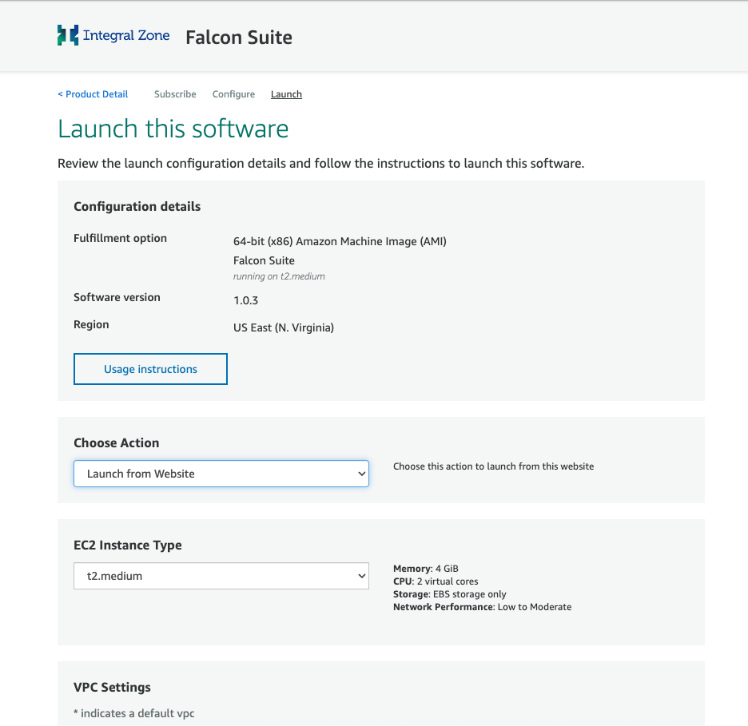
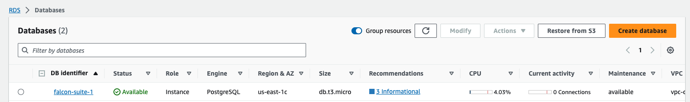
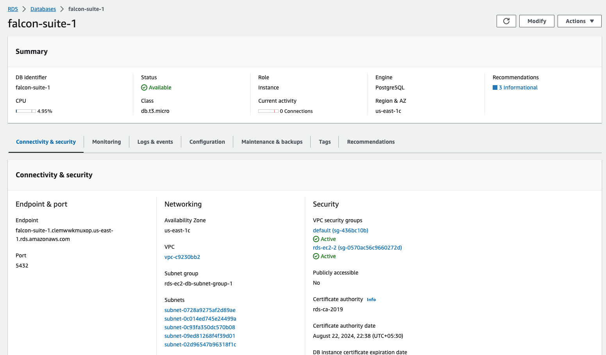
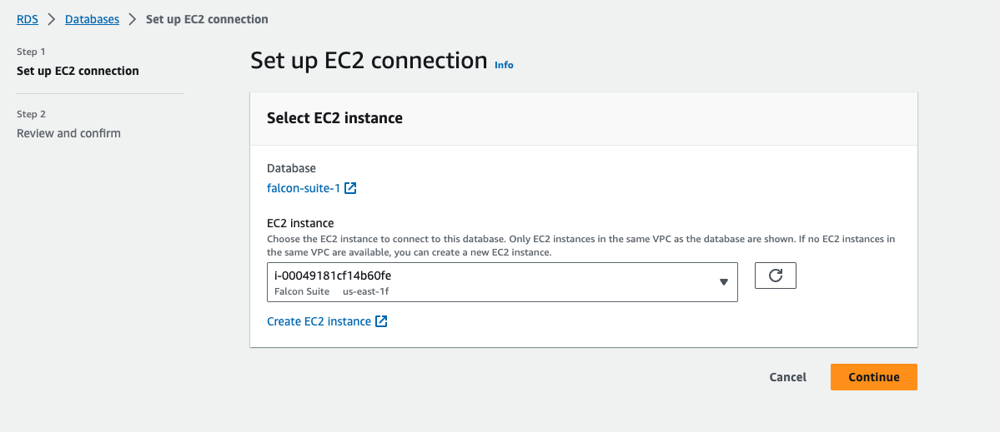

# Subscription

## Subscribe To IZ Suite

The AWS Marketplace is an online store that makes it easy for customers to start using IZ Suite and its services that run on the Amazon Web Services (AWS) cloud.

IZ Suite is a powerful code scanning tool meticulously crafted to ensure the seamless operation of your Live MuleSoft projects. As your vigilant ally, it continuously monitors active MuleSoft projects in real time, scrutinizing every line of code for potential quality issues.

With IZ Suite by your side, say goodbye to manual code reviews and time consuming inspections. Our cutting-edge tool swiftly identifies code quality issues, potential bugs, and security vulnerabilities, allowing you to address them proactively before they escalate.

### Marketplace Listing

1. Navigate to **`AWS Marketplace`** - https://aws.amazon.com/marketplace
2.  Search for **`IZ Suite`**  

    <figure><figcaption></figcaption></figure>

### How To Subscribe

1.  Click on `Continue to Subscribe`  

    <figure><figcaption></figcaption></figure>
2.  Click on `Continue to Configure`  

    <figure><figcaption></figcaption></figure>
3.  Select the software version, Fulfillment option, region and click on `Continue to Launch`  

    <figure><figcaption></figcaption></figure>
4.  Select the instance type, VPC Setting, Subnet Setting, Security Group and click on `Launch`  

    <figure><figcaption></figcaption></figure>
5. A new EC2 instance will be created in the selected region.

### Create a Database


* This step is required if the instance is being configuring for the first time.
* This step can be ignored if the marketplace product instance is being updated to a new version.


1. Login to AWS management console. https://aws.amazon.com/console/
2. Navigate to **`Services`** -> **`RDS`** and click on **`Create Database`**
3.  Select **`PostgreSQL`** engine type, username, password, storage, backup options and click on `Create Database`  

    <figure><figcaption></figcaption></figure>
4.  Click on the created RDS database instance and copy the endpoint\
    &#x20;

    <figure><figcaption></figcaption></figure>
5.  Click on **`Actions`** -> **`Setup EC2 Connection`**. Select the EC2 Instance created earlier and click on `Continue` to setup the connection between EC2 and RDS.  

    <figure><figcaption></figcaption></figure>

### Configure Database details and start the server

1. Login to the created EC2 instance using the downloaded pem file. Eg: ssh -i \<downloaded.pem> ubuntu@\<publicip>
2. Navigate to **`/home/ubuntu/iz-server`**
3. Open .env.defaults file and update the database connection details
   1. Search for **`DATABASE_URL`** key replace the **`dbhost`**, **`port`**, **`username`**, **`password`** and **`dbname`**
4. Navigate to /home/ubuntu and start the IZ suite server
   1. ./start-falcon-suite.sh
5. This will run the IZ server and cloud agent in background
6. Navigate to **`http://<publicip>:8910`** in the browser

### Configure SSO


* This step is required if the instance is being configuring for the first time.
* This step can be ignored if the marketplace product instance is being updated to a new version.


1. If the instance is being configured for the first time or to configure IZ Suite with Anypoint SSO follow the documentation here - IZ Initial Setup

### See Also

* Configure Schedule
* Endpoints
* Categories
* Public Status Page
* Private Status Page
