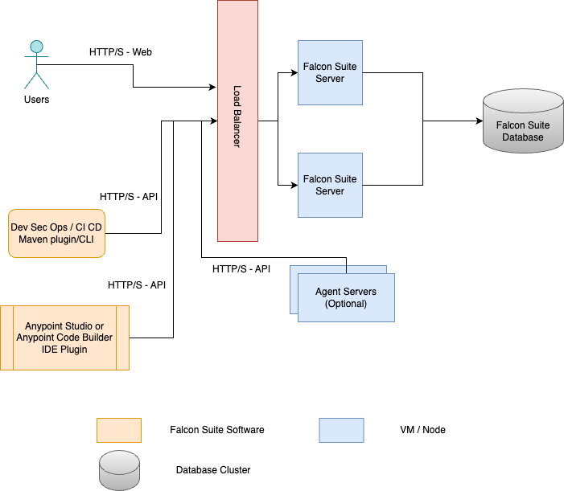

# Cluster Installation

## IZ Suite Cluster Installation


Before installing, make sure you have:

* Purchased a valid license.
* Installed the **`IZ Suite`** Single Server Installation


The cluster install allows IZ Suite to run in a clustered configuration to make it resilient to failures.

### Overview

The default configuration for the cluster install comprises a load balancer, at least 2 stand alone server installations (with agents installed in them or have additional agent nodes as per requirement) and a database server:

1. Two **`IZ suite server nodes`** responsible for handling web requests from users (Web component) and handling computational requirements (API component). You can add additional IZ suite server nodes to increase computing capabilities. SSDs perform significantly better than HDDs for these nodes
2. A **`Reverse Proxy / Load Balancer`** to load balance traffic between the two IZ suite server nodes. The installing organization must supply this hardware or software component.
3. **`IZ Suite database cluster`** - PostgreSQL database is recommended. Other supported database list can be seen from our requirements section of the documentation. This software must be supplied by the installing organization.
4. **`IZ Suite agent nodes`** - If you have installed agents on the IZ suite server nodes itself, you would not need additional agent nodes. If you install additional agent nodes for custom requirements, you do not need to configure them as a cluster or behind a load balancer and can act independently.

With this configuration, one IZ suite server node can be lost without impacting users. Here is a diagram of a simple topology: 

<figure><figcaption></figcaption></figure>

### Additional considerations

For better performance, especially when using large number of IZ pulse end point scanning, it is recommended to have additional agent nodes on separate machine to perform the health checks.

All IZ suite server nodes should be identical in terms of hardware and software. IZ suite server and agent nodes, however, can differ from one another. Generally, agent nodes are configured with more CPU and RAM than IZ suite server nodes.

### See Also

* Prerequisites
* Single Server Installation
