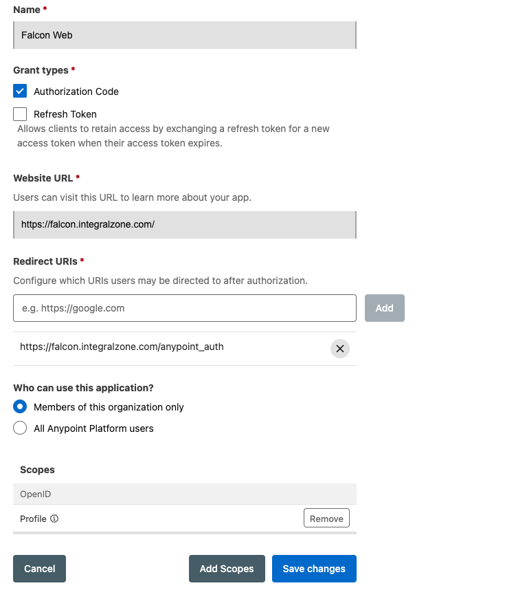

# Getting Started

This section outlines the initial setup and onboarding process for the IZ Suite instance.


In a multi-tenant installation, each tenant follows these steps on its own login URL (`https://<slug>.<your IZ Suite domain>`). The platform administrator onboards the tenant first. See [Onboard Tenant](../../integral-zone/iz-suite/iz-core/multi-tenancy/onboard-tenant.md).


### Apply License

1. The first time the instance is launched, a license needs to be applied.
2. Access the application from your browser and click on **`Get Started`**, then on **`Apply License Key`**.
   1. On **`Setup Application`** enter:
      1. **`License key`** - provided by Integral Zone as part of the onboarding process
      2. **`Base URL`** - the URL of this instance as users reach it in the browser, for example `https://company-iz.integralzone.com`. It is used in the links of emails sent by IZ Suite
      3. **`Admin email`**, **`Admin password`** and **`Confirm password`** - the credentials of the first administrator. The password must be at least 12 characters and include a number and a special character
   2. Click on **`Apply License`**&#x20;
3. Upon your first login, you will be prompted to apply the license. The License Key and Email will be provided by Integral Zone as part of the onboarding process.
4. Enter the License Key and Email, then click Apply.

### Initial Login

1. Access the application from your browser and click on **`Get Started`**
2. Click on **`IZ User`**
3. Sign in with the admin email and password entered when the license was applied. See [Sign-in and MFA](../../integral-zone/iz-suite/iz-core/sign-in-and-mfa.md)


Up to 26.3.x the first sign-in used **`Sign-in with IZ Token`** and an access token provided by Integral Zone. From 26.4.1 the IZ Token sign-in is replaced by **IZ User Auth** (email and password).&#x20;


### Setup Single Sign-on

Follow these steps to enable Anypoint CloudHub SSO:

1. Create a connected app in CloudHub to enable SSO:
   1. Navigate to https://anypoint.mulesoft.com
   2. Navigate to **`Access Management`** -> **`Connected Apps`** (Admin permissions might be required for this operation)
   3. Click on **`Create App`**
   4. Use **`IZ Web`** as the Connected App name
   5. **`Type`** - Acts on behalf of a user
   6. **`Grant Types`** - Authorization Code
   7. **`Website URL`** - Your IZ instance url. Eg: https://company-iz.integralzone.com
   8. **`Redirect URIs`** - \<Your IZ instance url>/anypoint\_auth. Eg: https://company-iz.integralzone.com/anypoint\_auth
   9. **`Who can use this application`** -> Members of this organization only
   10. **`Scopes`** -> Click on Add Scopes and select **`Open Id`** -> **`Profile`**
   11. Save the setting. We will be using the generated Client Id and Client Secret in the next steps\
       &#x20;

       <figure><figcaption></figcaption></figure>
2. Sign-in to IZ Suite application
3. After signing to the application, navigate to **`Global Settings`** -> **`Settings`**
4. Search for **`Anypoint Auth`** and click on **`Edit`** action item
   1. Update the value of **`isEnabled`** to **`true`**
   2. Update the Anypoint Connected App’s Client Id and Client Secret in respective fields
   3. Click on Submit
5. Log out of the application and Sign-in with CloudHub option should be enabled.


A tenant onboarded by a platform administrator starts with **`Anypoint Auth`**, **`Google Auth`** and **`Azure Auth`** disabled and without credentials. Configure the provider of your choice as described above before disabling IZ Token sign-in


### Automatic User Creation (Optional)

By default every user must be invited before signing in. To let users who authenticate successfully through single sign-on be created automatically with a default set of roles, configure **`Login Settings`**. See [Login Settings](../../integral-zone/iz-suite/iz-core/login-settings.md).

### Disable `Signin with IZ Token` Option

`Signin with IZ Token` feature is intended only for initial system setup and should be disabled once one of the `Single Sign-on` options is isEnabled.

Generate admin login token

1. Navigate to **`Global Settings`** -> **`Settings`**
2. Navigate to **`Organization`** -> **`Tokens`** and click on **`Generate Token`**
   1. **`Token Name`** - Admin Login
   2. **`Expiry`** - Can be left blank
   3. **`Roles`** - IZ Core Admin
   4. Click on Submit and save the token which can be used when any of the configured Single Sign-on options has issues

Disable Sign-in with IZ Token

1. Search for **`IZ Token Auth`**
   1. Update the value of **`isEnabled`** to **`false`**

### Administrator Sign-in

If all other sign-in options become unavailable, a licence administrator, such as the admin entered when the license was applied, can still sign in with their email and password, even while **`IZ User`** sign-in is disabled:

1. Use the following URL: https://\<HOST>/iz/oauth?response\_type=code\&redirect\_uri=/auth/iz/callback\&admin=true
2. Enter the administrator's email and password. Use **`Forgot password?`** on the same page if the password is not known.

From 26.4.1 security tokens generated under **`Organization`** -> **`Tokens`** can no longer be used to sign in to the web application; they are used by the IZ Scan CLI, IDE plug-ins and MCP clients. See [Sign-in and MFA](../../integral-zone/iz-suite/iz-core/sign-in-and-mfa.md).

### Configure CICD Pipeline

The following step is applicable only for **`IZ Scan`**

1. [**`CICD Integration using Maven`**](../../integral-zone/iz-suite/iz-scan/ci-cd-integration/using-maven.md) - Maven CICD Scanner

### Session Timeout

Sessions expire after the period configured in **`Global Settings`** → **`Settings`** → **`Login Settings`** → **`Session Timeout Seconds`** (one hour by default). See [Login Settings](../../integral-zone/iz-suite/iz-core/login-settings.md).

### Configure Agent

The following step is applicable only for **`IZ Eye`** and **`IZ Pulse`**.

1. Running Default Agent - Running Agent
2. Configure New Agent - New Agent

### Setup Anypoint Studio Plugin

1. [**`Anypoint Studio Plugin Installation`**](../releases/anypoint-studio-plugin/) - Install Plugin
2. [**`Anypoint Studio Plugin Setup`**](../../integral-zone/iz-analyzer/manage-anypoint-studio-plugin/) - Configuration
3. [**`Anypoint Studio Plugin Fly Results`**](../../integral-zone/iz-suite/iz-scan/anypoint-studio/source-code-analysis/anypoint-studio-analysis.md) - On The Fly Results

### Setup Anypoint Code Builder

1. [**`Anypoint Code Builder Plugin Installation`**](../../arm/integration-and-plugins/visual-code-extension/installing-vs-code-extension.md) Install Plugin
2. [**`Anypoint Code Builder Plugin Setup`**](../../arm/integration-and-plugins/visual-code-extension/configuring-vscode-extension.md) - Configuration
3. [**`Anypoint Code Builder Fly Results`**](../../integral-zone/iz-suite/iz-scan/vs-code-extension/source-code-analysis/on-the-fly-results.md) - On The Fly Results

### See Also

* [Prerequisites](installation-requirements.md)
* [Cluster Mode](../../integral-zone/iz-suite/installation/modes/cluster-installation.md)
