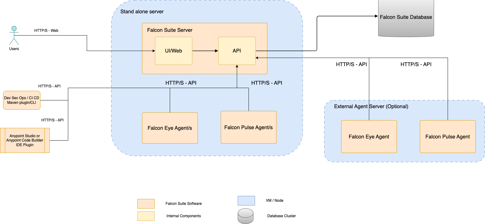

# Single Server Installation

## IZ Suite Single Server Installation


Before installing, make sure you have:

* Purchased a valid license.


The single server section describes the installation of a single-node **`IZ Suite`** instance from the ZIP file or from a docker image.

### Components of IZ Suite Server Installation

In a single server deployment model, IZ suite has the following main components:

1. **`IZ Suite Server`**: IZ Suite server component with UI, backend API
2. **`IZ Suite Database`**: IZ Suite requires a database (PostgreSQL preferred) to be installed which contains all the data needed for the server
3. **`IZ Agents`**: IZ Suite requires an agent component for certain products to work (for example - IZ Eye and IZ Pulse). 

<figure><figcaption></figcaption></figure>

### Installation Steps

1. **`Install IZ Suite Database`**: For optimal performance, the database and server should be installed on separate servers. If a database already exists, keep the database connection details handy to configure the server installation.
2. **`Install the IZ Suite server`**: This can be a stand alone server installation from a zip file or from a docker image. You would need to follow installation instructions to point the server to the IZ suite database
3. **`Install IZ Agents`**: You can download agent from a zip file or from a docker image. You would need to configure the agent to point to the IZ suite server for them to connect and work.

### Performance considerations

For optimal performance, the database and server should be installed on separate servers. On a development or trial instance, database can be installed on the same machine as the IZ suite software for easy debug/maintenance.

Depending on the connectivity use cases, the agents could be co-located with the IZ suite server or could be installed on different machines. Number of agents and location will depend on licensing and customer requirements. For most public use cases, agent could be co-located with the IZ server installation.

### See Also

* [Prerequisites](installation-requirements.md)
* [Cluster Mode](cluster-installation.md)
