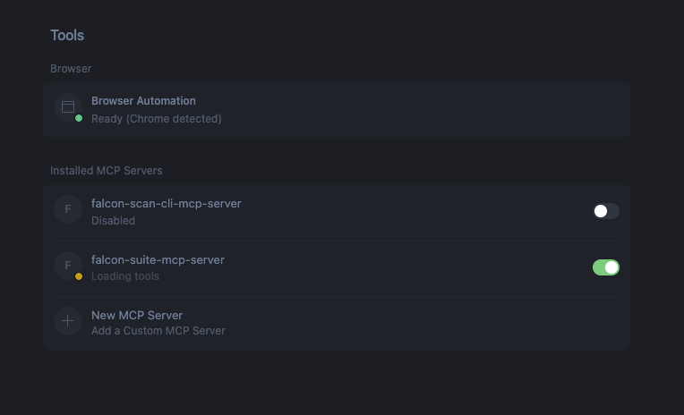

# HTTP MCP Server Configuration

The following section describes the steps required to configure the IZ HTTP MCP server in various IDEs.

### Visual Studio Code

* Open the preferences and search for MCP
* Click on **`MCP: Add Server`** -> **`HTTP (HTTP or Server-side Events)`**
* Enter the URL (Eg: http(s)://\<YOUR\_HOST\_NAME>/mcp and click enter) and name as **`iz-suite-mcp-server`**
* A mcp.json file with the entered details will be opened
* Add the following headers **`x-iz-service-url`**, **`x-iz-access-token`**.
* To generate a token, refer token generation
* The final configuration should look something like

```json
"iz-suite-mcp-server": {
    "url": "http(s)://&lt;YOUR_HOST_NAME>/mcp",
    "type": "http",
    "headers": {
        "x-iz-service-url": "http(s)://&lt;YOUR_HOST_NAME>",
        "x-iz-access-token": "&lt;Token Generated from IZ Suite>"
    }
}
```

### Cursor IDE

* Open the preferences and search for MCP
* Click on **`View: Open MCP Settings`**
* In the settings screen click on **`New MCP Server`** and add the below configuration:

```json
    "iz-suite-mcp-server": {
        "url": "http(s)://&lt;YOUR_HOST_NAME>/mcp",
        "type": "http",
        "headers": {
            "x-iz-service-url": "http(s)://&lt;YOUR_HOST_NAME>",
            "x-iz-access-token": "&lt;Token Generated from IZ Suite>"
        }
    }
```

* To generate a token, refer token generation
* Save the mcp.json file.
* Navigate back to Cursor Settings tab and toggle the enable switch.&#x20;

<figure><figcaption></figcaption></figure>

### See Also

* Enabling MCP Server
* Generating MCP Token
* Configuring STDIO MCP Server
* MCP Tools
