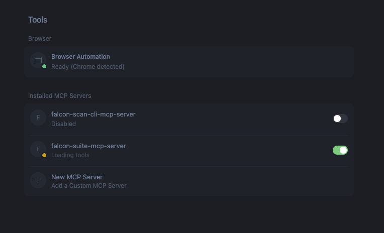

# HTTP MCP Server Configuration

The following section describes the steps required to configure the IZ HTTP MCP server in various IDEs.





* Every request must carry two headers: **`x-falcon-service-url`** with the URL of your IZ Suite instance and **`x-falcon-access-token`** with a token generated as described in [Generating MCP Token](generating-mcp-token.md).
* In a multi-tenant installation the value of **`x-falcon-service-url`** must be your **tenant's** URL (for example `https://acme.izsuite.example.com`). The tenant is identified from this URL; a request for an unknown or suspended tenant is rejected, and a token from another tenant is not accepted.
* The tools offered are those of your tenant: the common IZ tools plus the automation tasks of your tenant that are marked **`Include in MCP Server`**


### Visual Studio Code

* Open the preferences and search for MCP
* Click on **`MCP: Add Server`** -> **`HTTP (HTTP or Server-side Events)`**
* Enter the URL (Eg: http(s)://\<YOUR\_HOST\_NAME>/mcp and click enter) and name as **`iz-suite-mcp-server`**
* A mcp.json file with the entered details will be opened
* Add the following headers **`x-falcon-service-url`**, **`x-falcon-access-token`**
* To generate a token, refer token generation
* The final configuration should look something like

```json
"iz-suite-mcp-server": {
    "url": "http(s)://<YOUR_HOST_NAME>/mcp",
    "type": "http",
    "headers": {
        "x-falcon-service-url": "http(s)://<YOUR_HOST_NAME>",
        "x-falcon-access-token": "<Token Generated from IZ Suite>"
    }
}
```

### Cursor IDE

* Open the preferences and search for MCP
* Click on **`View: Open MCP Settings`**
* In the settings screen click on **`New MCP Server`** and add the below configuration:

```json
       "iz-suite-mcp-server": {
        "url": "http(s)://<YOUR_HOST_NAME>/mcp",
        "type": "http",
        "headers": {
            "x-falcon-service-url": "http(s)://<YOUR_HOST_NAME>",
            "x-falcon-access-token": "<Token Generated from IZ Suite>"
        }
    }
```

* To generate a token, refer token generation
* Save the mcp.json file.
* Navigate back to Cursor Settings tab and toggle the enable switch.&#x20;

<figure><figcaption></figcaption></figure>

### Copying the Configuration from IZ Suite


The ready-to-use configuration for your instance, including the correct headers and hostname, can be copied from **`Global Settings`** -> **`MCP Server Setup`**. Replace the token placeholder with your generated token.

#### Troubleshooting <a href="#troubleshooting" id="troubleshooting"></a>

| Response                            | Cause                                                                                                                         |
| ----------------------------------- | ----------------------------------------------------------------------------------------------------------------------------- |
| `401` / authentication error        | The token is missing, expired, or was generated in a different tenant than the service URL.                                   |
| `404 Unknown or inactive tenant`    | The **`x-falcon-service-url`** does not match a tenant hostname, or the tenant is suspended.                                  |
| Tool list is empty or misses a task | The token's role lacks the permission required by the tool, or the automation task is not marked **`Include in MCP Server`**. |

### See Also

* [Enabling MCP Server](mcp-server-installation.md)
* [Generating MCP Token](generating-mcp-token.md)
* [Configuring STDIO MCP Server](stdio-mcp-server-configuration.md)
* [MCP Tools](mcp-tools.md)
