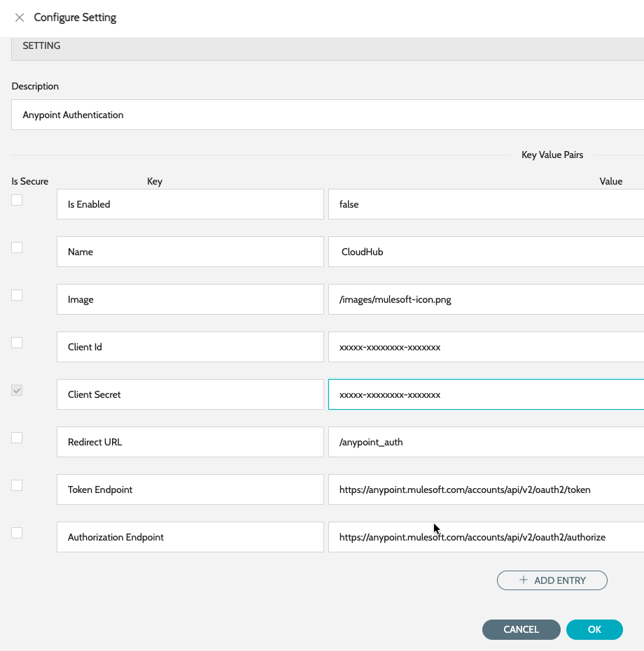

# Anypoint SSO Configuration

IZ Suite can be configured to integrate with Anypoint SSO to enable secure, centralized authentication across the platform. By connecting IZ Suite with the organization’s Anypoint identity provider configuration, users can authenticate using their existing enterprise credentials.

### Creating Connected App in Anypoint Platform

Follow the below steps to create a Connected App in Anypoint Platform -

1. Navigate to **Access Management** -> **Connected Apps** -> **Create App**
2. Enter the basic details -
   1. **Name** - Name of the Connect App
   2. **Type** - App acts on behalf of a user
   3. **Grant types** - Authorization Code
   4. **Website URL** - URL of IZ Suite instance
   5. **Redirect URIs** - https://\<iz\_suite\_url>/anypoint\_auth
   6. **Who can use this application?** - Members of this organization only
   7. **Scopes** - Click on add scopes, search for Profile and select **OpenId Profile** and click Add Scopes
3. Click on Save
4. Copy the Client ID and Secret which be used to configure the SSO in IZ Suite

### Configuring the App in IZ Suite

1. Navigate to main menu **Global Settings** -> **Settings** and search for **Anypoint Auth**
2. Click on edit action item
3. Enter the following details -
   1. **Is Enabled** - Set the value to true
   2. **Client Id** - The client id from the Anypoint's Connected App's page
   3. **Client Secret** - The secret copied while generating the Client secret
4. Click on save

<figure><figcaption></figcaption></figure>

### See Also

* [Configure Code Scan Schedules](../azure-ai-services/schedule-configuration.md)
* [Logic Apps](../azure-ai-services/applications/logic-applications.md)
* [API Management](../azure-ai-services/applications/apim-applications.md)
* [Function Apps](../azure-ai-services/applications/function-applications.md)
