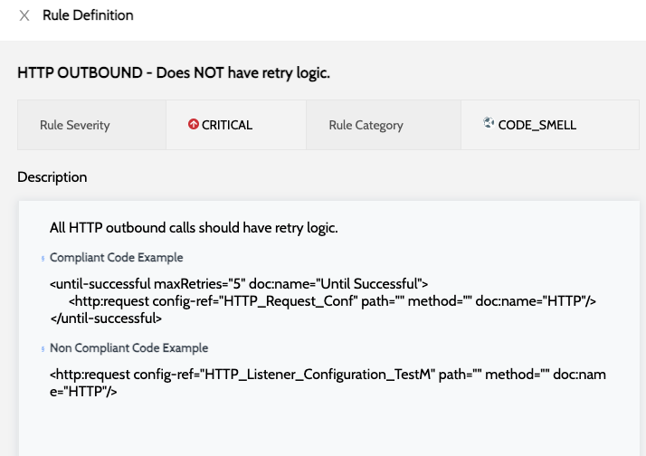

# Application Issues


* Application issues display the file name and line number of the raised issue
* Application source code will not be stored / displayed


To view all detailed report of the issues -

1. Navigate to **`IZ Eye`** and select any application type. Eg: Mule Projects or APIs
2.  Click on the **`View Issues`** action of any of the applications\
    &#x20;

    <figure><figcaption></figcaption></figure>
3. Issues will be grouped by file names and details include -
   1. The violating rule name
   2. Line number of the violation in the file
   3. Rule severity. E.g.: MAJOR, CRITICAL, etc.
   4. Rule category. E.g.: CODE SMELL, BUG, etc.
4.  To get details/description of the rule being violated, click on **`SEE RULE`**\
    &#x20;

    <figure><figcaption></figcaption></figure>

### See Also

* [Mule Projects](mule-applications.md)
* [API Applications](api-applications.md)
* [Application Dashboard](application-dashboard.md)
