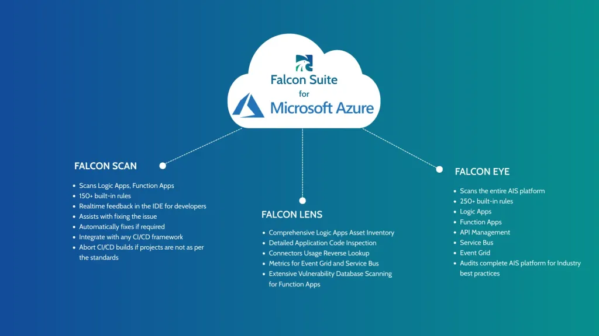

# Overview

## IZ Suite for Azure Integration Services

IZ Suite for Azure Integration Services provides one unified platform for visibility, dependency analysis, and governance in Azure Integration Services - helping teams better see what exists in their integration estate, how assets relate to each other, and manage risk before changes cause failures or outages.

### Azure Integration Challenges

Azure Integration Services (such as Logic Apps and API Management) deliver scalable integration but teams often face key challenges:

* Limited visibility into what integrations exist across Logic Apps and APIM.
* Difficulty understanding dependencies between workflows and APIs.
* Inconsistent standards and governance across teams.
* Risky changes leading to unexpected failures or outages.

### Solution: Visibility and Governance

<figure><figcaption></figcaption></figure>

IZ Suite brings automated visibility and governance to Azure Integration Services, helping teams manage and scale their Azure integration landscapes with confidence.

### Key Benefits

* **`Clear Visibility`** - See all Azure integration assets and how they connect.
* **`Stronger Governance`** - Apply consistent best practices and policies across integration workflows.
* **`Reduced Risk`** - Spot issues and potential gaps before they impact production.
* **`More Confidence in Delivery`** - Improve quality assurance as integration estates grow.

### Core Capabilities

* **`Automated Discovery & Inventory`** - IZ Suite automatically identifies Logic Apps, APIs, and related integration components.
* **`Dependency & Architecture Visualization`** - Visual maps showing how workflows and APIs connect across environments.
* **`Policy & Configuration Assessment`** - Evaluate integration components against governance policies and standards.
* **`Change Impact Insights`** - Understand what may break or be affected as estates evolve.

### Who It’s Designed For

IZ Suite for Azure is aimed at:

* Azure Integration Services Architects
* Integration Developers and Practitioners
* Platform and Integration Leaders tasked with governance, visibility, and risk.
