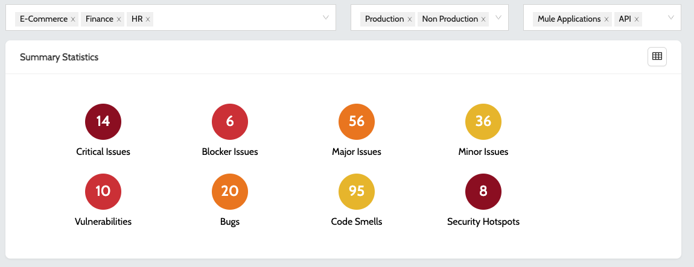
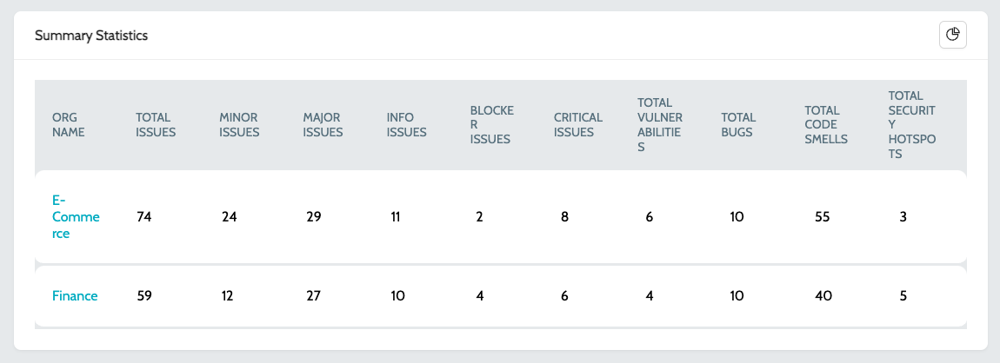
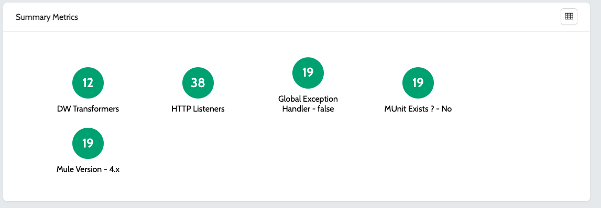
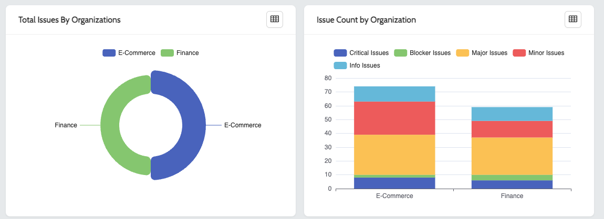
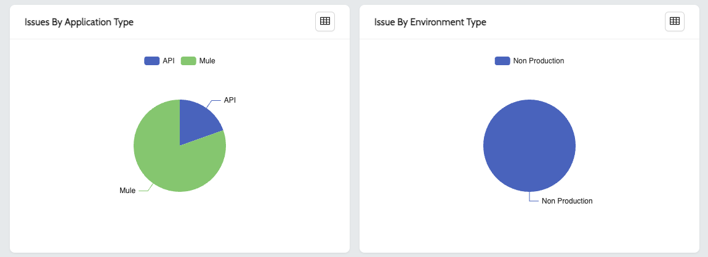
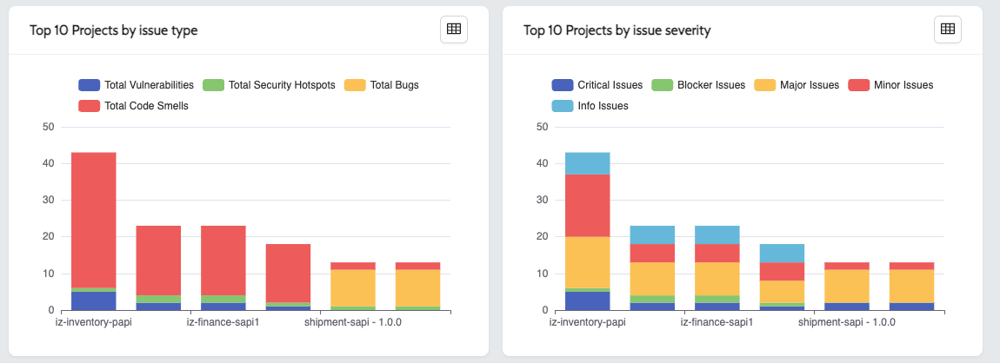

# Dashboard

The dashboard provides a bird’s eye view of all the issues and metrics across all the organizations and environments. Issues can also be drilled down from organization level to application level.

1. Navigate to **`IZ Eye`** -> **`Dashboard`**
2.  **`Summary Statistics`** displays the count of all issues grouped by rule severity and category across all organizations  

    <figure><figcaption></figcaption></figure>
3.  Click on any of the issue count and select the organization to drill down to the next level, i.e., to a specific organization or environment or application  

    <figure><figcaption></figcaption></figure>
4.  **`Summary Metrics`** displays the aggregated metrics report across all the organizations\
    &#x20;

    <figure><figcaption></figcaption></figure>
5. **`Total Issues By Organizations`** displays the aggregated count of issues by organization
6.  **`Issue Count by Organization`** displays the count of issues grouped by rule severity across all the organizations  

    <figure><figcaption></figcaption></figure>
7. **`Issues By Application Type`** displays the count of issues by Application type across all the organizations E.g.: Mule, API
8.  **`Issue By Environment Type`** displays the count of issues by Environment across all the organizations E.g.: Production, Non Production  

    <figure><figcaption></figcaption></figure>
9. **`Top 10 Projects by issue type`** displays the top 10 projects with grouped by rule severity across all the organizations
10. **`Top 10 Projects by issue severity`** displays the top 10 projects with grouped by rule category across all the organizations  

    <figure><figcaption></figcaption></figure>

### See Also

* [Configure Schedule](../../integral-zone/iz-suite/iz-pulse/configure-schedule.md)
* [Application Dashboard](../../integral-zone/iz-suite/iz-eye/anypoint-platform/application-dashboard.md)
* [Agent Job Types](../../integral-zone/iz-suite/iz-core/agent/agent-job-types.md)
* [Mule Projects](../../integral-zone/iz-suite/iz-eye/anypoint-platform/applications/mule-applications.md)
* [API Applications](../../integral-zone/iz-suite/iz-eye/anypoint-platform/applications/exchange-apis.md)
