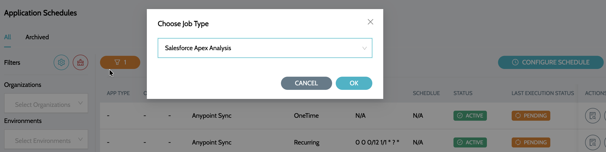
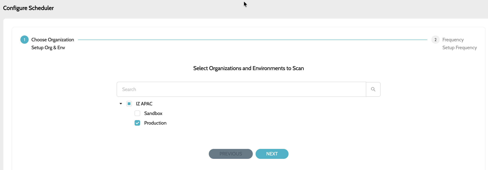

# Schedule Configuration

## Configure Schedule


* It is required to create the External Client App in Salesforce before configuring the schedules - [Configure External Client App](external-client-application-configuration.md)
* Repeatedly creating a schedule for the same organization and environment will simply overwrite the pre-existing schedule.


### Configuring schedule for continuous code scans

1. Navigate to **`Schedules`** -> **`Schedules`** and click on **`Configure Schedule`**
2. Select **`Salesforce Apex Analysis`** job type&#x20;

<figure><figcaption></figcaption></figure>

3. Select the Organizations and Environments to perform the scan&#x20;

<figure><figcaption></figcaption></figure>

4. Select the schedule/frequency at which the analysis should be performed

.png>) 

5. Click on **`Submit`** to configure the schedule

All the Apex classes and Triggers created in the selected Organizations and Environments will be scheduled for continues scans.

### See Also

* [Configure External Client App](external-client-application-configuration.md)
* [Apex Classes & Triggers](applications/apex-classes-and-triggers.md)
