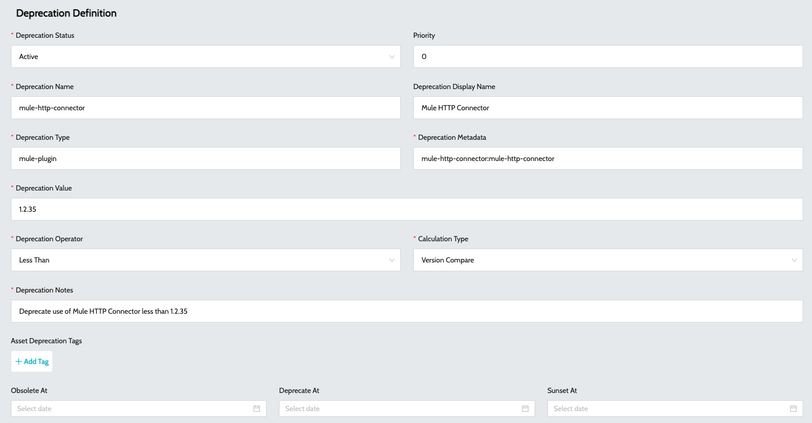
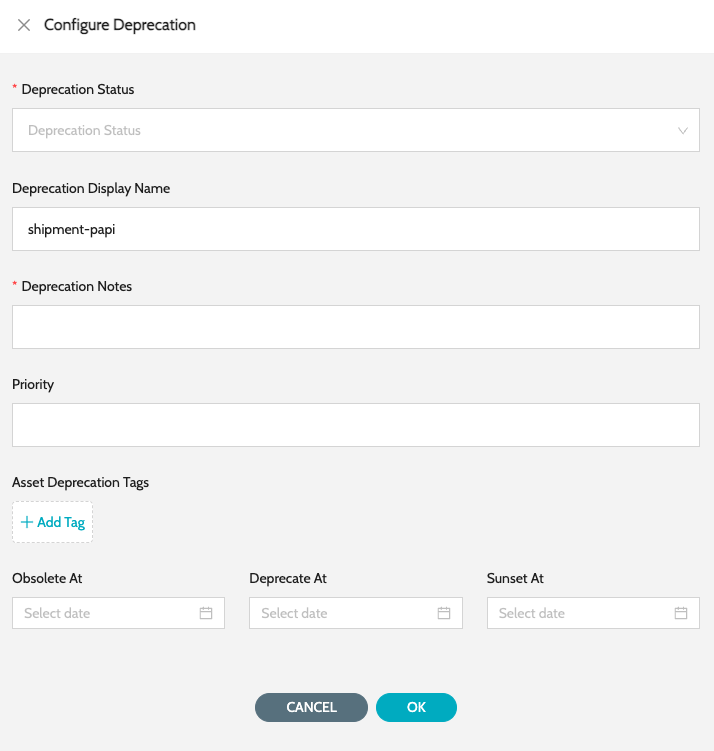

# Deprecations

This feature allows users to define and manage application deprecations.

### Deprecations

List of all the deprecations defined in the system.

* Navigate to **`IZ Lens`** -> **`Deprecations`**.
* **`Type`** - Type of asset E.g.: mule-plugin, rest-api.
* **`Display Name`** - Readable name for the deprecation asset.
* **`Value`** - Version of the asset being deprecated.
* **`Deprecated Apps Count`** - Total applications marked for deprecation based on the defined rule.
* **`Status`** - Status of the deprecation. Possible values include -
  * **`Active`**
  * **`Obsolete`**
  * **`Deprecated`**
  * **`Sunset`**
* **`Actions`** Displays the total assets / applications that are deprecated based on the rules configured in Deprecations. Actions include -
  * **`Update Deprecation`** - Update deprecation definition
  * **`View Deprecated Applications`** - View the list of application marked for deprecation using the defined rule
  * **`Delete`** - Delete deprecation rule

### Configure Deprecations

Click on **`Add Deprecation`** button to create a new deprecation rule. Fields include -

* **`Deprecation Status`** - Status of the deprecation. Possible values include -
  * **`Active`**
  * **`Obsolete`**
  * **`Deprecated`**
  * **`Sunset`**
* **`Deprecation Name`** - Name of the deprecation asset. E.g.: mule-http-connector
* **`Deprecation Display Name`** - Readable name of the deprecation asset.
* **`Deprecation Type`** - Type of asset E.g.: mule-plugin, rest-api.
* **`Deprecation Metadata`** - Deprecated asset’s metadata.
* **`Deprecation Value`** - Version of the asset being deprecated.
* **`Deprecation Operator`** - Comparison operator to be used when applying the rule.
* **`Calculation Type`** - Comparison types include -
  * **`Version Compare`** - SemVer comparison. Ideally used for version comparison
  * **`String Compare`** - Used to compare string values
* **`Deprecation Notes`** - Additional notes to define the deprecation

<figure><figcaption></figcaption></figure>

### Deprecate an API Asset

This option can be used to deprecate an API asset version. Once the deprecation rule is defined, all the associated / dependent applications will be marked for deprecation as well.

1. Navigate to **`IZ Eye`** -> **`APIs`** and search for the API version which has to be deprecated
2. Click on **`Configure Deprecation`** to deprecate a specific API asset version

<figure><figcaption></figcaption></figure>

### See Also

* Inventory
* Aggregated Dashboard
* Application Dashboard
* Mule Projects
* API Applications
