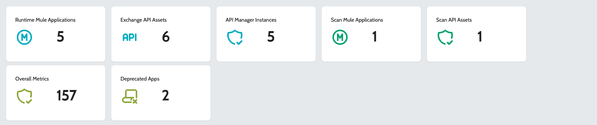
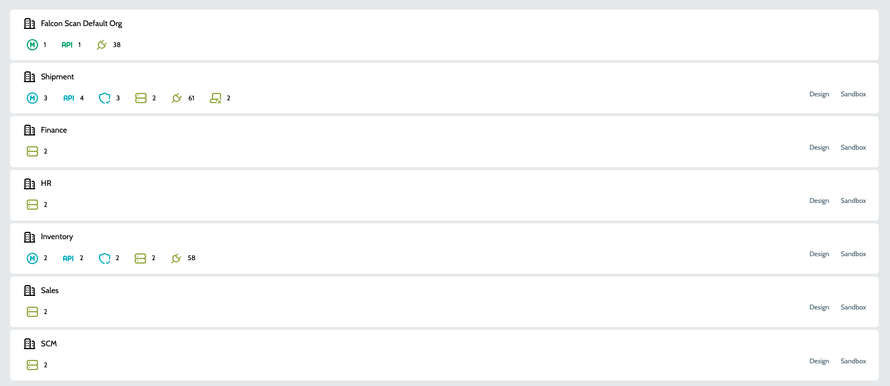
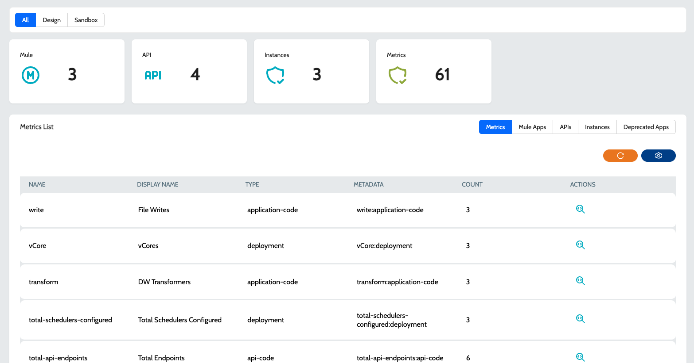

# Inventory

Inventory provides an overview of the application inventory and associated details across organizations and environments. The Inventory dashboard provides an overview of the organizational hierarchy, detailing the total number of organizations, their environments, deployed runtime applications, available APIs, connectors used in applications, and the count of deprecated applications. To ensure accurate tracking, a periodic background job analyzes the inventory data and compares it with the defined deprecations to identify deprecated applications and updates the system accordingly.

### Application Statistics

<figure><figcaption></figcaption></figure>

* **`Runtime Mule Applications`** - Total Mule applications deployed in Anypoint Runtime Manager.
* **`Exchange API Assets`** - Total RAML / OAS assets deployed to Anypoint Exchange.
* **`API Manager Instances`** - Total API Manager instances in Anypoint Platform.
* **`Scan Mule Applications`** - Total Mule applications scanned using IZ Scan CLI.
* **`Scan API Assets`** - Total API assets scanned using IZ Scan CLI.
* **`Deprecated Apps`** Displays the total assets / applications that are deprecated based on the rules configured in Deprecations.
* **`Overall Metrics`** - Total Metrics collected across all applications.

### Statistics Across Organization

<figure><figcaption></figcaption></figure>

Each organization will be associated with following stats -

* **`Runtime Mule Applications`** - Total Mule applications deployed in Anypoint Runtime Manager.
* **`Exchange API Assets`** - Total RAML / OAS assets deployed to Anypoint Exchange.
* **`API Manager Instances`** - Total API Manager instances in Anypoint Platform.
* **`Scan Mule Applications`** - Total Mule applications scanned using IZ Scan CLI.
* **`Scan API Assets`** - Total API assets scanned using IZ Scan CLI.
* **`Deprecated Apps`** Displays the total assets / applications that are deprecated based on the rules configured in Deprecations.
* **`Overall Metrics`** - Total Metrics collected across all applications.

### Organization Statistics

More details about the inventory for each organization can be drilled down by clicking on the organization name -

**`Metric Details`** displays the list of collected metrics across applications. Details can be furthered filtered by **`Environments`** or **`Application Types`** or even by **`Deprecated Apps` .**

<figure><figcaption></figcaption></figure>

### See Also

* Deprecations
* Aggregated Dashboard
* Application Dashboard
* Mule Projects
* API Applications
