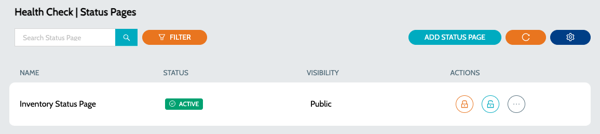

# Status Pages

Status Page is a collection of endpoint categories.

1.  Navigate to **`IZ Pulse`** -> **`Status Pages`**  

    <figure><figcaption></figcaption></figure>
2. Details Include
   1. **`Status`** - Status of the Status Page
   2. **`Visibility`** - Visibility of the Status Page. Possible values include -
      1. **`PRIVATE`** - Private status pages are authenticated and includes both private and public endpoints
      2. **`PUBLIC`** - Public status pages are unauthenticated and will have a public URL. Public pages only include public endpoints
3. Click on `View Private Page` action to view the private page.
4. Click on `View Public Page` action to view the public page.

### See Also

* [Configure Schedule](../configure-schedule.md)
* [Endpoints](../endpoints/)
* [Categories](../../categories/)
* [Public Status Page](public-status-page.md)
* [Private Status Page](private-status-page.md)
