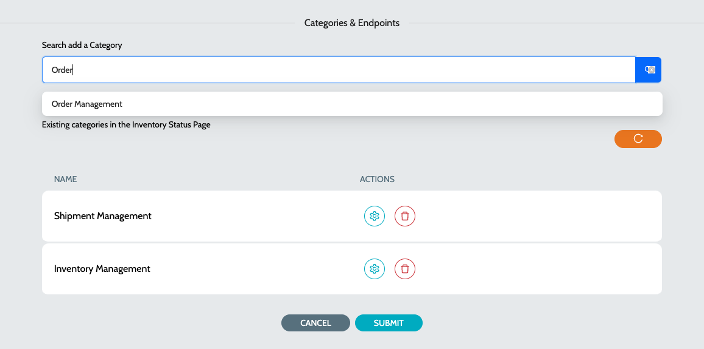

# Configure Status Page

### Basic Details

1. Navigate to **`IZ Pulse`** -> **`Status Pages`** and click on **`Add Status Page`**
2. Enter a name for the status page and click on Submit

### Add Categories

1. Click on **`Edit Status Page`** action to configure the categories
2. Search for a **`Category`** and select the same to add it as part of the status page
3.  The selected categories will be displayed in a table\
    &#x20;&#x20;

    <figure><figcaption></figcaption></figure>

### See Also

* [Configure Schedule](../configure-schedule.md)
* [Endpoints](../endpoints/)
* [Categories](../../categories/)
* [Status Pages](./)
